# ESC Scope 3 Demo - Chat and Outputs Analysis

## Overview

This document provides a comprehensive analysis of the ESC Scope 3 Demo HTML export, which represents the final output from the ESG financed emissions analysis workflow.

## File Structure

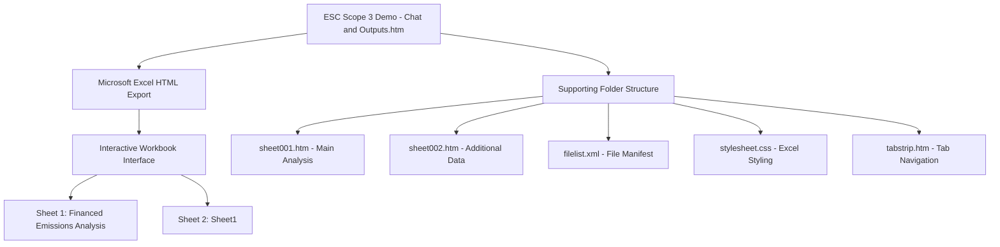

## Technical Architecture

```mermaid
architecture-beta
    group browser(logos:chrome)[Browser Environment]
    
    service frameset(logos:html5)[HTML Frameset] in browser
    service mainsheet(logos:microsoft-excel)[Main Sheet Frame] in browser
    service tabstrip(logos:javascript)[Tab Strip Frame] in browser
    service navigation(logos:javascript)[Navigation Controls] in browser
    
    frameset:R --> L:mainsheet
    frameset:R --> L:tabstrip
    tabstrip:R --> L:navigation
    navigation:R --> L:mainsheet
```

## JavaScript Framework Components

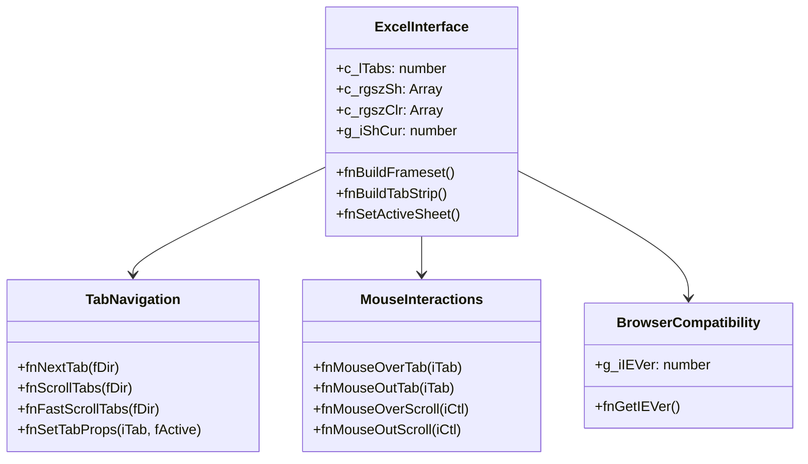

## Workbook Structure

### Sheet Configuration
- **Total Sheets**: 2
- **Primary Sheet**: "Financed Emissions Analysis"
- **Secondary Sheet**: "Sheet1"

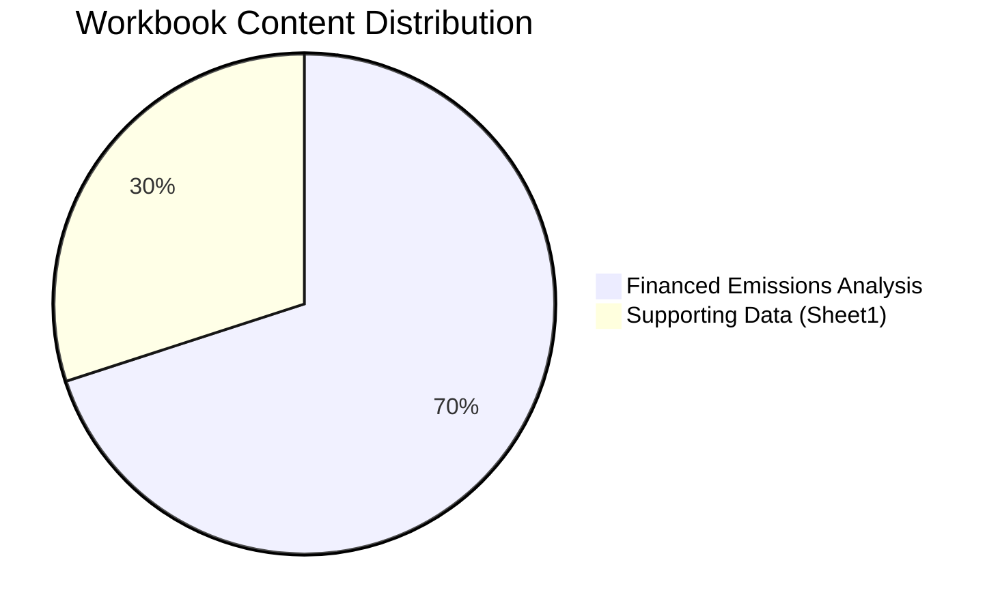

## Color Scheme and Styling

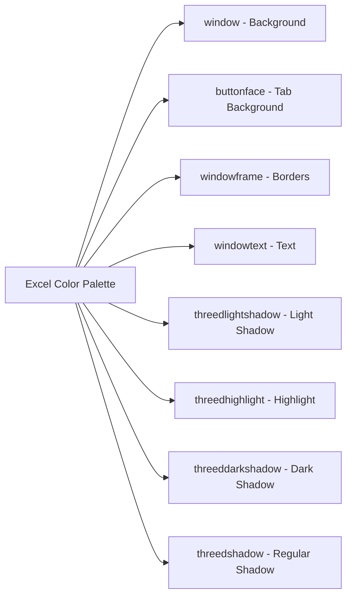

## Browser Compatibility Matrix

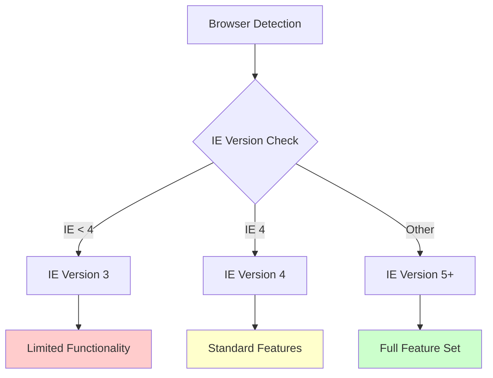

## Interactive Features

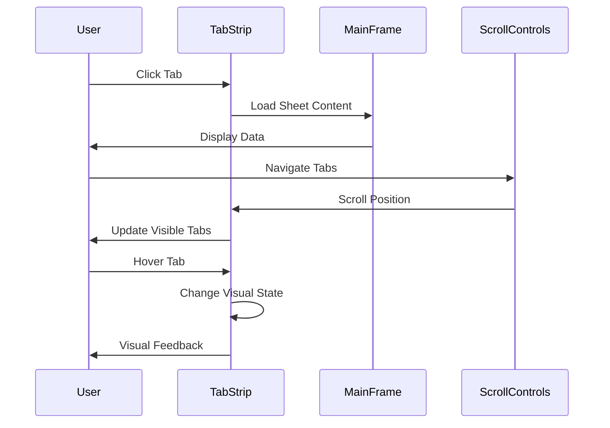

## Data Flow Architecture

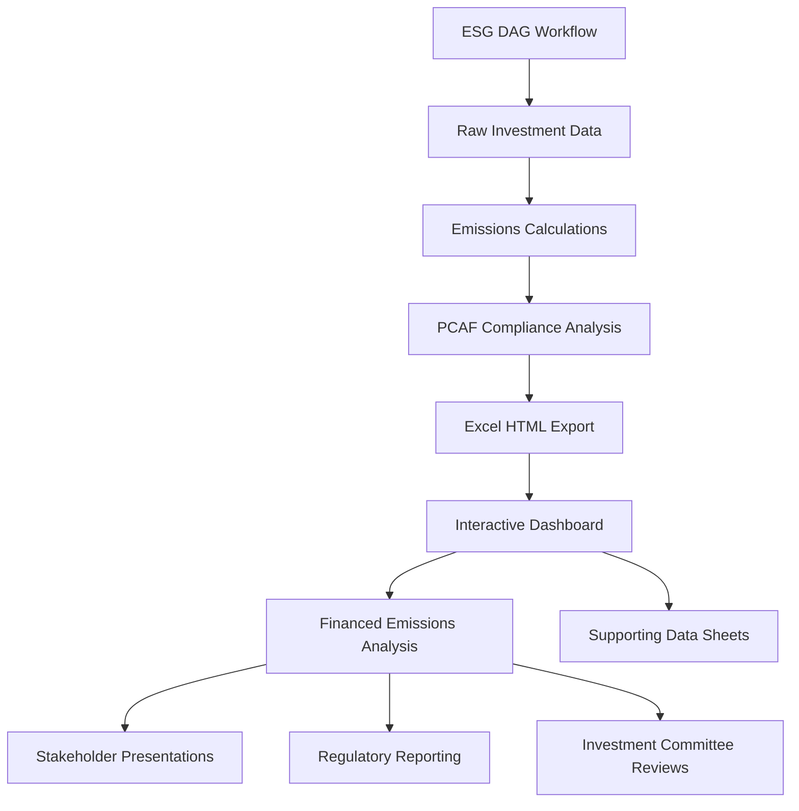

## Window Configuration

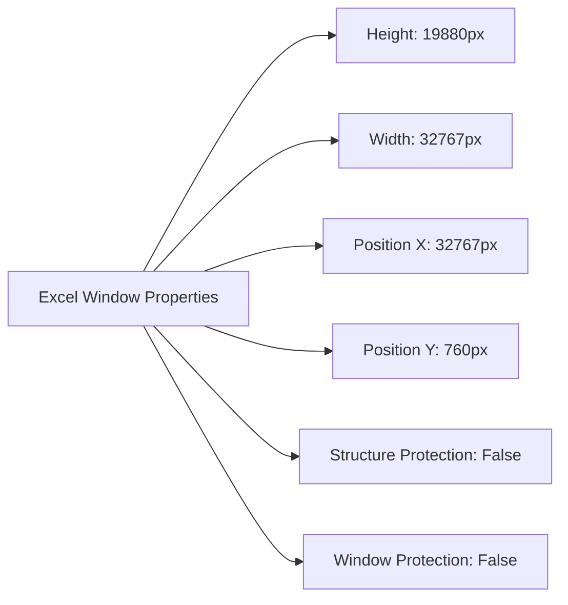

## File Dependencies

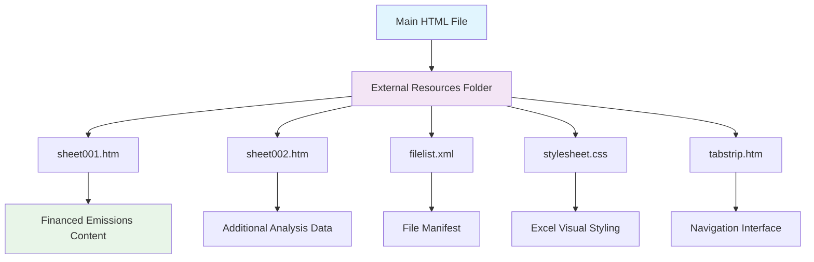

## Integration with ESG Workflow

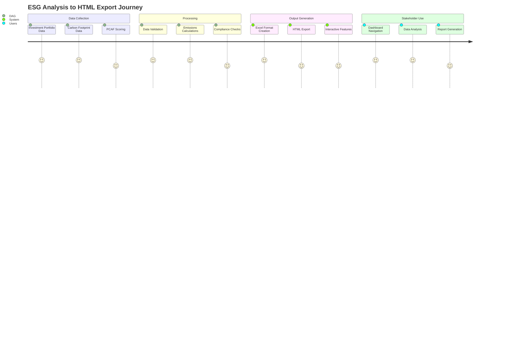

## Technical Specifications

### JavaScript Functions Overview

| Function Category | Key Functions | Purpose |
|------------------|---------------|---------|
| **Frame Management** | `fnBuildFrameset()`, `fnBuildTabStrip()` | Create Excel-like interface |
| **Navigation** | `fnScrollTabs()`, `fnNextTab()` | Tab scrolling and navigation |
| **Interaction** | `fnMouseOverTab()`, `fnSetActiveSheet()` | User interaction handling |
| **Compatibility** | `fnGetIEVer()` | Browser version detection |

### Meta Information

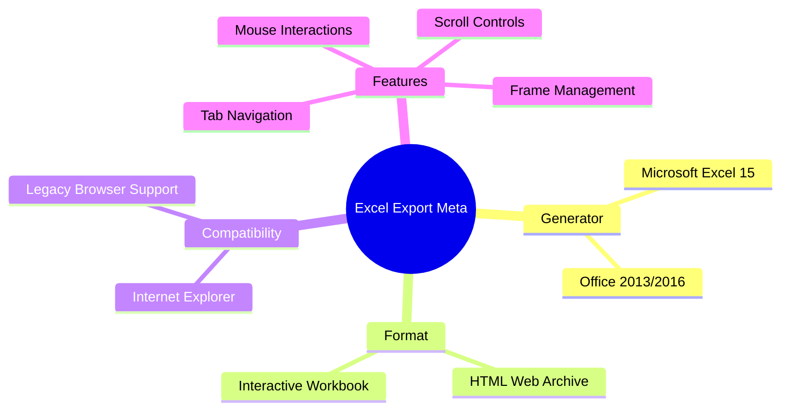

## Business Value Proposition

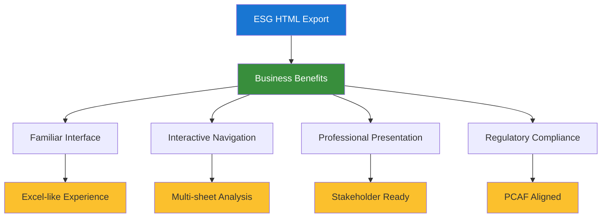

## Usage Scenarios

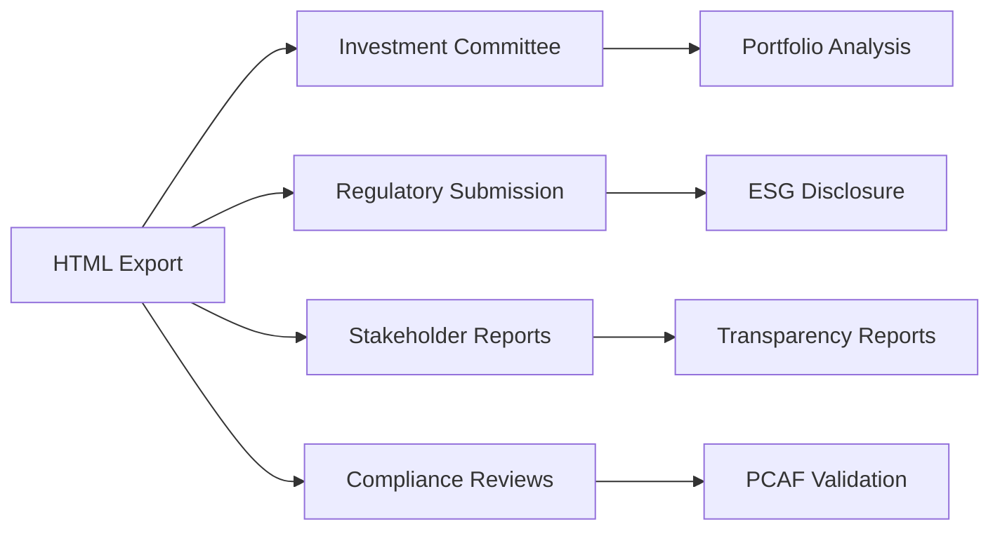

## Conclusion

This ESC Scope 3 Demo HTML file represents a sophisticated conversion of complex ESG analysis results into an interactive, business-ready format. The file leverages Microsoft Excel's HTML export capabilities to create a familiar interface that stakeholders can navigate intuitively while maintaining the analytical depth required for regulatory compliance and investment decision-making.

The technical implementation demonstrates advanced JavaScript framework integration for creating Excel-like functionality in web browsers, making it a valuable bridge between technical ESG processing workflows and business presentation needs.
