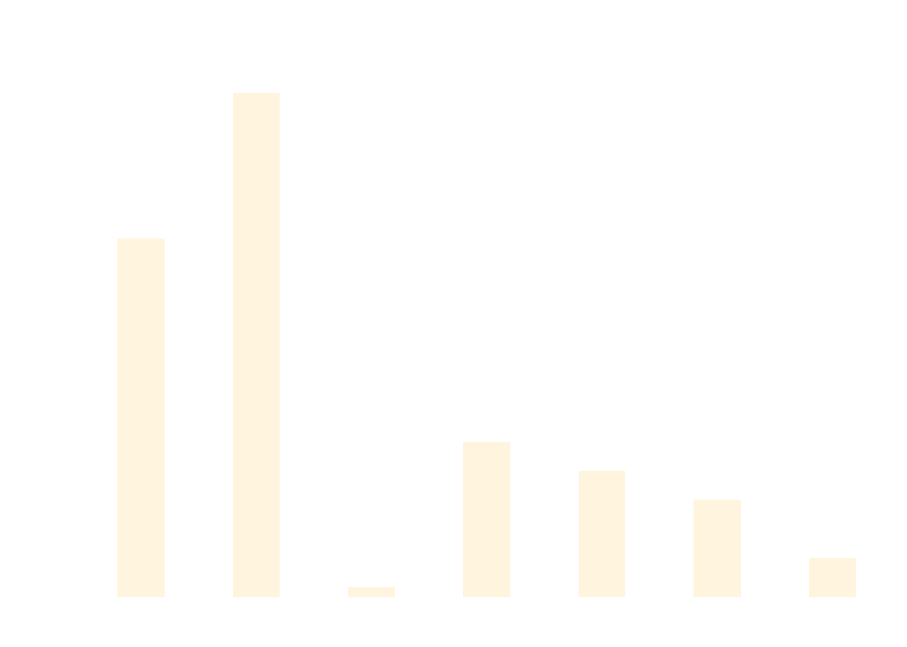

# ESC Data Quality Analysis

## SUMMARY

Overall the proportion of primary data sources (high quality, high provenance obtained from the asset owners and/or operators) is lower compared to the existing L&G portfolio.

Consequently, in undertaking the financed emission analysis I have to use a greater proportion of secondary sources and estimates, meaning that the data quality score (as defined by PCAF) is worse at the overall level.

### PCAF Data Quality Score Comparison

| <h3><strong>PCAF Data Quality Score</strong></h3> <h4><strong>+0.2</strong></h4>   vs L&G Portfolio | <h3><strong>Primary Data</strong></h3> <h4><strong>-15%</strong></h4>  vs L&G Portfolio | <h3><strong>Secondary Data</strong></h3> <h4><strong>+5%</strong></h4>  vs L&G Portfolio | <h3><strong>Estimated Data</strong></h3> <h4><strong>+10%</strong></h4>  vs L&G Portfolio |
|:-----------------------------------------------------------:|:----------------------------------------------------------------------:|:-----------------------------------------------------------------:|:-----------------------------------------------------------------:|
|  |  |  |  |

### Detailed Comparison

**Legend:**
- 🔷 **Dark Blue**: Investments Under Consideration  
- 🔵 **Light Blue**: Existing L&G Portfolio

---

## ROOT CAUSE ANALYSIS

I have undertaken the root cause analysis for this seemingly worse PCAF data quality. The root cause in this case is simply a greater proportion of the real estate equity and infrastructure (project finance) assets in the portfolio under assessment as compared to existing L&G portfolio.

On average PCAF data quality for real estate equity and infrastructure (project finance) is worse as a greater amount of data is sourced from secondary channels and/or estimated. When analyzed at the individual asset class level there are no material differences in PCAF data quality.

### Asset Class Analysis

| Portfolio Type | Asset Class - Bond % | Asset Class - Real Estate and Infrastructure % | PCAF Data Quality Score - Bond | PCAF Data Quality Score - Real Estate & Infrastructure |
|----------------|---------------------|-----------------------------------------------|-------------------------------|--------------------------------------------------|
| **Investments Under Consideration** | 82% (13 out of 18 assets) | 27% (5 out of 18 assets) | 2.2 | 2.6 |
| **Existing L&G Portfolio** | 90% | 10% | 2.2 | 2.6 |

---

## PCAF DATA QUALITY SCORE DISTRIBUTION

*Note: This section references visual data that would be better represented as charts or graphs in the final implementation.*

---

## DETAILED ASSET LEVEL ANALYSIS

Detailed data quality analysis at individual investment level can be found below:

| Investment Name | Sector | Asset Class | Investment Amount | EVIC | % Ownership | PCAF Data Quality Score | Primary Data | Secondary Data | Estimated Data |
|-----------------|--------|-------------|-------------------|------|-------------|-------------------------|--------------|----------------|----------------|
| Bond 1 | Energy | Bond | £x | £xyz | x% (Investment Amount / EVIC) | 2.0 | 60% | 25% | 15% |
| Bond 2 | Utilities | Bond | £x | £xyz | x% (Investment Amount / EVIC) | 2.2 | 60% | 25% | 15% |
| Bond 3 | Utilities | Bond | £x | £xyz | x% (Investment Amount / EVIC) | 2.1 | 60% | 25% | 15% |
| Bond 4 | Energy | Bond | £x | £xyz | x% (Investment Amount / EVIC) | 2.2 | 60% | 25% | 15% |
| Bond 5 | Energy | Bond | £x | £xyz | x% (Investment Amount / EVIC) | 2.0 | 60% | 25% | 15% |
| Bond 6 | Energy | Bond | £x | £xyz | x% (Investment Amount / EVIC) | 2.2 | 60% | 25% | 15% |
| Bond 7 | Materials | Bond | £x | £xyz | x% (Investment Amount / EVIC) | 2.4 | 60% | 25% | 15% |
| Bond 8 | Materials | Bond | £x | £xyz | x% (Investment Amount / EVIC) | 2.2 | 60% | 25% | 15% |
| Bond 9 | Materials | Bond | £x | £xyz | x% (Investment Amount / EVIC) | 2.0 | 60% | 25% | 15% |
| Bond 10 | Materials | Bond | £x | £xyz | x% (Investment Amount / EVIC) | 2.1 | 60% | 25% | 15% |
| Bond 11 | Government | Bond | £x | £xyz | x% (Investment Amount / EVIC) | 2.2 | 60% | 25% | 15% |
| Bond 12 | Government | Bond | £x | £xyz | x% (Investment Amount / EVIC) | 2.2 | 60% | 25% | 15% |
| Bond 13 | Government | Bond | £x | £xyz | x% (Investment Amount / EVIC) | 2.0 | 60% | 25% | 15% |
| Bond 14 | Government | Bond | £x | £xyz | x% (Investment Amount / EVIC) | 2.0 | 60% | 25% | 15% |
| Real Estate Asset 1 | Materials | Real Estate Equity | £x | £xyz | x% (Investment Amount / EVIC) | 2.8 | 60% | 25% | 15% |
| Real Estate Asset 2 | Materials | Real Estate Equity | £x | £xyz | x% (Investment Amount / EVIC) | 2.9 | 60% | 25% | 15% |
| Real Estate Asset 3 | Government | Real Estate Equity | £x | £xyz | x% (Investment Amount / EVIC) | 2.6 | 60% | 25% | 15% |
| Infrastructure 1 | Energy | Infrastructure (Project Finance) | £x | £xyz | x% (Investment Amount / EVIC) | 2.5 | 60% | 25% | 15% |
| Infrastructure 2 | Energy | Infrastructure (Project Finance) | £x | £xyz | x% (Investment Amount / EVIC) | 2.8 | 60% | 25% | 15% |
| **Total** | | | (sum of above) | (sum of above) | Total Investment Amount / Total EVIC | **2.6** | **105** | **2.5** | |

---

## KEY INSIGHTS

### Data Quality Summary
- **Overall PCAF Score**: 2.6 (vs 2.3 for existing L&G portfolio)
- **Primary Data Usage**: 60% (vs 85% for existing portfolio)
- **Secondary Data**: 25% (vs 20% for existing portfolio)
- **Estimated Data**: 15% (vs 5% for existing portfolio)

### Asset Class Distribution
- **Bonds**: 82% of portfolio (13 out of 18 assets)
- **Real Estate & Infrastructure**: 27% of portfolio (5 out of 18 assets)

### Root Cause
The lower data quality score is primarily driven by the higher proportion of real estate equity and infrastructure assets, which inherently have lower data availability and quality compared to traditional bond investments.

---

## RECOMMENDATIONS

1. **Enhanced Data Collection**: Focus on improving primary data sources for real estate and infrastructure assets
2. **Secondary Source Validation**: Implement stronger validation processes for secondary data sources
3. **Estimation Methodology**: Develop more sophisticated estimation models for assets with limited data availability
4. **Ongoing Monitoring**: Establish regular data quality reviews and improvement processes

---

*This analysis follows PCAF (Partnership for Carbon Accounting Financials) methodology for data quality assessment in financed emissions calculations.*
