# ESG Scope 3 Portfolio Analysis - Chat and Outputs Report

*Comprehensive analysis of 18 proposed investments with ESG metrics and sustainability assessment*

---

## Executive Summary

This document presents the results of a comprehensive ESG Scope 3 portfolio analysis conducted by OMNIS AI system for Legal & General (L&G). The analysis evaluates 18 proposed investments across multiple asset classes and sectors, comparing their carbon footprint against L&G's existing portfolio and external benchmarks.

### Key Findings Overview

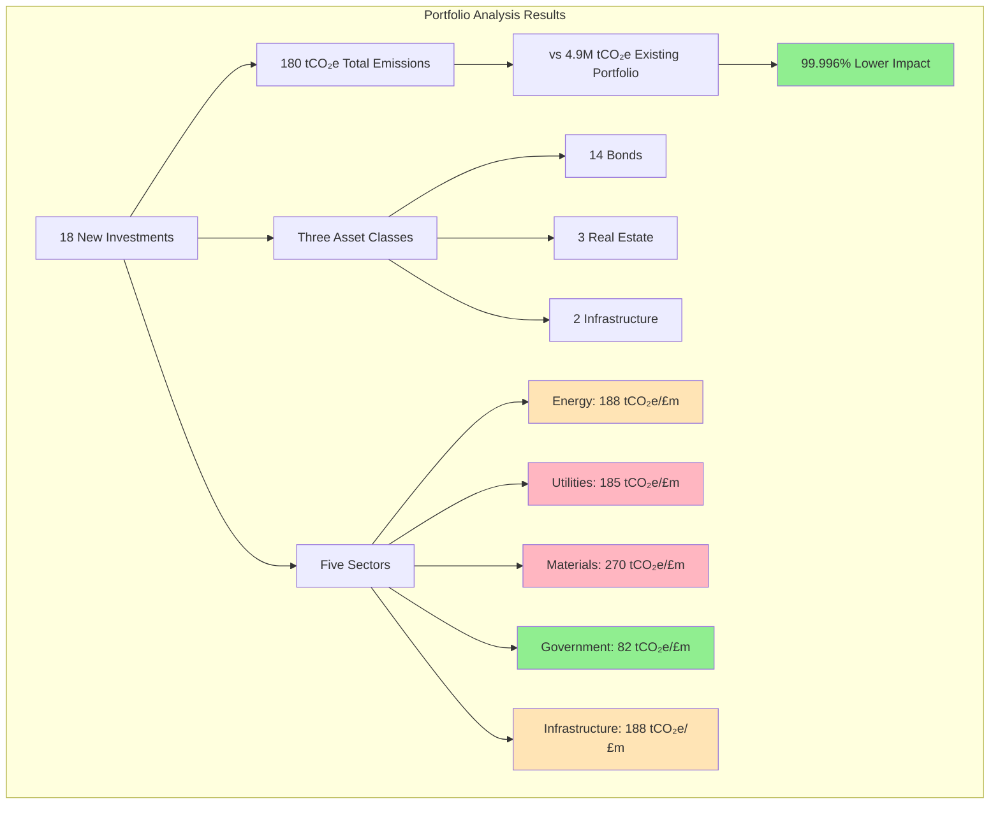

---

## Analysis Workflow

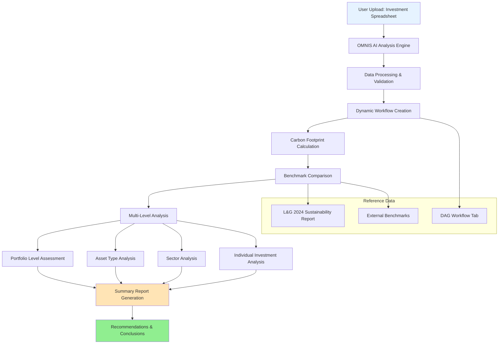

---

## Portfolio Overview & Key Metrics

### Investment Portfolio Composition

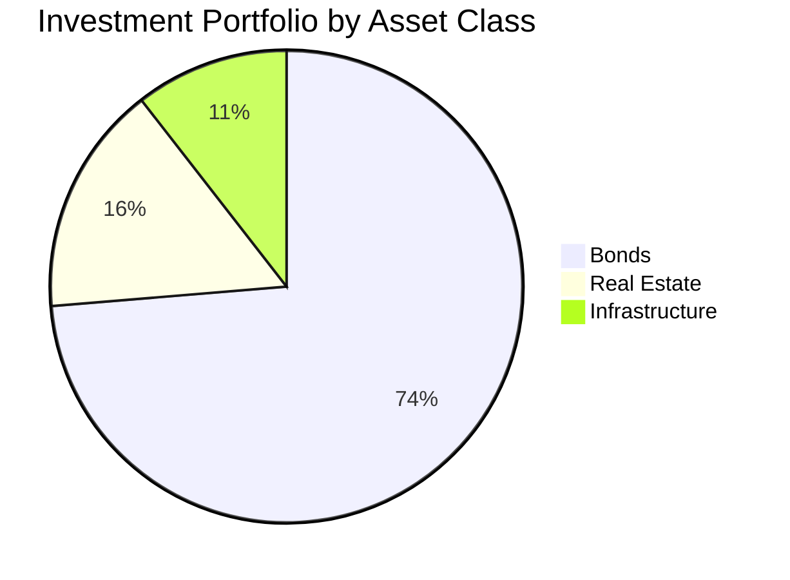

### Carbon Impact Comparison

| Metric | New Investments | L&G Existing Portfolio | Performance |
|--------|----------------|----------------------|-------------|
| **Total CO₂ Equivalent** | 180 tCO₂e | 4,900,000 tCO₂e | 🟢 -99.996% |
| **Carbon Intensity** | 42 tCO₂e/£m | 49 tCO₂e/£m | 🟢 -7 tCO₂e/£m |
| **WACI** | 105 | 117 | 🟢 -12 points |
| **Temperature Alignment** | 2.5°C | 2.8°C | 🟢 -0.3°C |

---

## Asset Type Performance Analysis

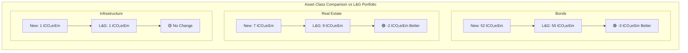

### Asset Type vs External Benchmarks

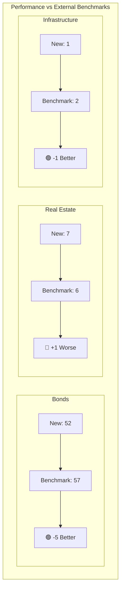

---

## Sector Analysis Dashboard

### Sector Performance vs L&G Portfolio

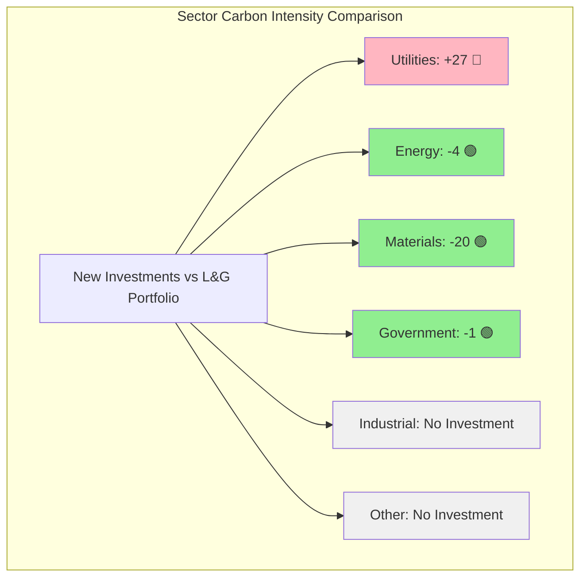

### Detailed Sector Metrics

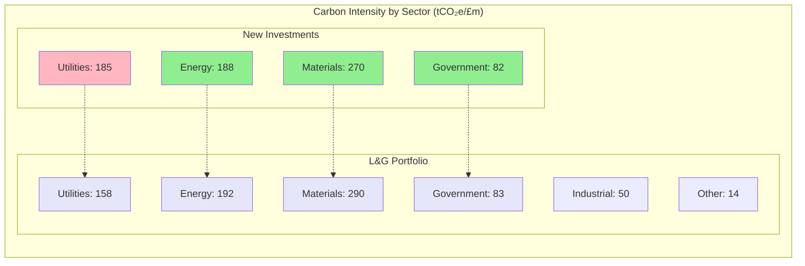

---

## Individual Investment Analysis

### Investment Distribution by Sector

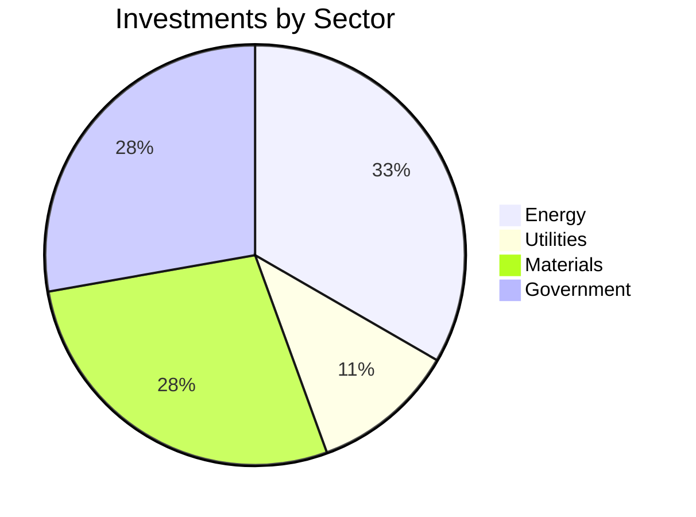

### Investment Performance Matrix

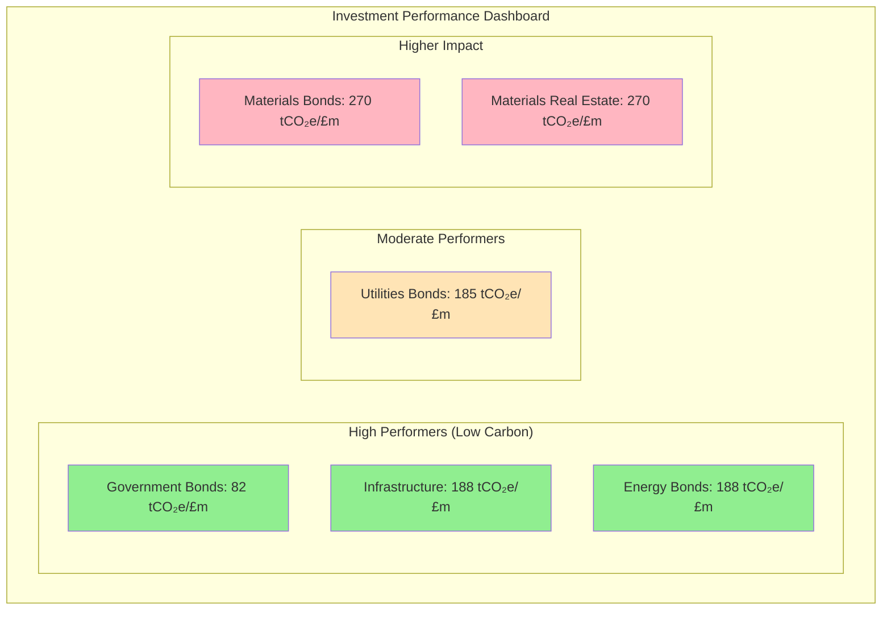

---

## Detailed Investment Breakdown

### Bond Investments (14 total)

| Investment | Sector | Carbon Intensity | WACI | Temperature Alignment |
|-----------|--------|------------------|------|---------------------|
| Bond 1 | Energy | 188 tCO₂e/£m | 105 | 2.6°C |
| Bond 2 | Utilities | 185 tCO₂e/£m | 121 | 2.8°C |
| Bond 3 | Utilities | 185 tCO₂e/£m | 124 | 2.9°C |
| Bond 4-6 | Energy | 188 tCO₂e/£m | 104-106 | 2.3-2.6°C |
| Bond 7-10 | Materials | 270 tCO₂e/£m | 105-111 | 2.4-2.6°C |
| Bond 11-14 | Government | 82 tCO₂e/£m | 98-105 | 2.2-2.5°C |

### Real Estate Assets (3 total)

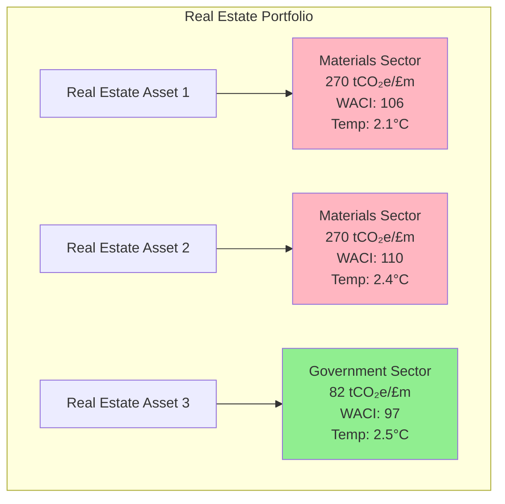

### Infrastructure Investments (2 total)

| Investment | Sector | Asset Class | Metrics |
|-----------|--------|-------------|---------|
| Infrastructure 1 | Energy | Project Finance | 188 tCO₂e/£m, WACI: 112, 2.4°C |
| Infrastructure 2 | Energy | Project Finance | 188 tCO₂e/£m, WACI: 107, 2.5°C |

---

## Conclusions and Recommendations

### Overall Portfolio Assessment

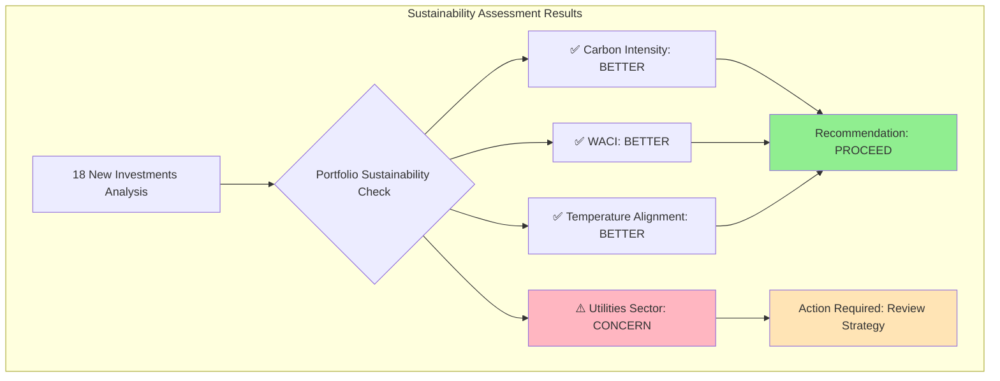

### Key Conclusions

1. **Overall Sustainability**: The 18 additional investments are more sustainable than L&G's existing portfolio across all key metrics
2. **Carbon Efficiency**: New investments demonstrate significantly lower carbon intensity
3. **Risk Profile**: Enhanced temperature alignment reduces climate transition risk
4. **Sectoral Concerns**: Utilities investments show higher carbon intensity than existing portfolio

### Strategic Recommendations

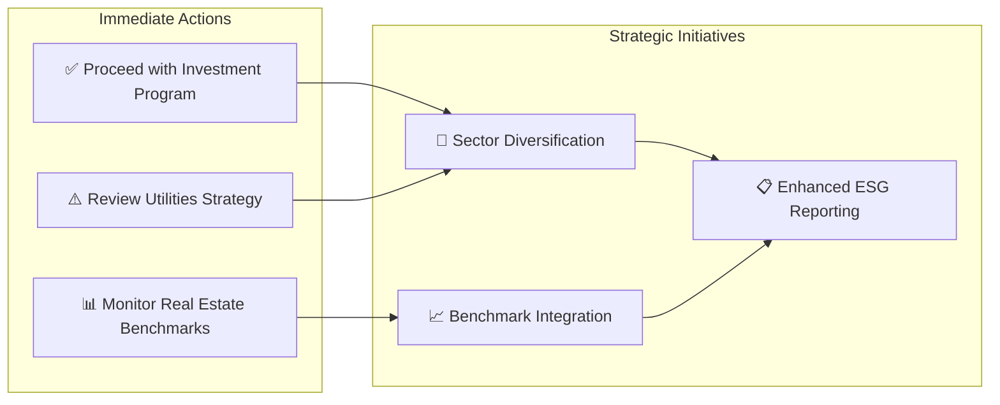

#### Priority Actions

1. **Utilities Sector Review**: Consider alternative investment strategy for utilities investments due to higher carbon intensity (+27 tCO₂e/£m vs existing portfolio)

2. **Real Estate Optimization**: While performing better than L&G portfolio, real estate investments still exceed external benchmarks

3. **Portfolio Integration**: Leverage strong performance in Energy, Materials, and Government sectors

4. **Reporting Enhancement**: Use detailed analysis for stakeholder communication and regulatory compliance

---

## Technical Appendix

### Analysis Methodology

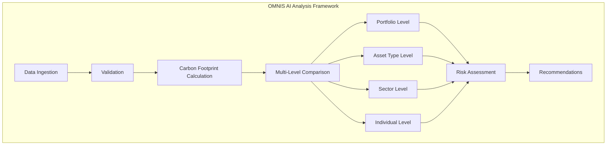

### Data Sources and References

- **New Investment Data**: User-uploaded spreadsheet
- **Benchmark Data**: L&G 2024 Sustainability Report
- **External Benchmarks**: Industry standard references
- **Workflow Reference**: DAG (Directed Acyclic Graph) tab

### Metrics Definitions

| Metric | Definition | Unit |
|--------|------------|------|
| **Carbon Intensity** | Carbon emissions per million pounds invested | tCO₂e/£m |
| **WACI** | Weighted Average Carbon Intensity across portfolio | Index |
| **Temperature Alignment** | Portfolio alignment with climate scenarios | Degrees Celsius |

---

*Report generated from ESG Scope 3 Demo analysis by OMNIS AI system*  
*Analysis Date: August 2025*  
*Source: ESC Scope 3 Demo - Chat and Outputs.csv*
