# ESG Scope 3 Portfolio Analysis - Chat and Outputs Report

*Comprehensive analysis of 18 proposed investments with ESG metrics and sustainability assessment*

---

## Executive Summary

This document presents the results of a comprehensive ESG Scope 3 portfolio analysis conducted by OMNIS AI system for Legal & General (L&G). The analysis evaluates 18 proposed investments across multiple asset classes and sectors, comparing their carbon footprint against L&G's existing portfolio and external benchmarks.

### Key Findings Overview

---

## Analysis Workflow

---

## Portfolio Overview & Key Metrics

### Investment Portfolio Composition

### Carbon Impact Comparison

| Metric | New Investments | L&G Existing Portfolio | Performance |
|--------|----------------|----------------------|-------------|
| **Total CO₂ Equivalent** | 180 tCO₂e | 4,900,000 tCO₂e | 🟢 -99.996% |
| **Carbon Intensity** | 42 tCO₂e/£m | 49 tCO₂e/£m | 🟢 -7 tCO₂e/£m |
| **WACI** | 105 | 117 | 🟢 -12 points |
| **Temperature Alignment** | 2.5°C | 2.8°C | 🟢 -0.3°C |

---

## Asset Type Performance Analysis

```mermaid
graph LR
    subgraph "Asset Class Comparison vs L&G Portfolio"
        subgraph "Bonds"
            B1[New: 52 tCO₂e/£m] --> B2[L&G: 55 tCO₂e/£m]
            B2 --> B3[🟢 -3 tCO₂e/£m Better]
        end
        
        subgraph "Real Estate"
            R1[New: 7 tCO₂e/£m] --> R2[L&G: 9 tCO₂e/£m]
            R2 --> R3[🟢 -2 tCO₂e/£m Better]
        end
        
        subgraph "Infrastructure"
            I1[New: 1 tCO₂e/£m] --> I2[L&G: 1 tCO₂e/£m]
            I2 --> I3[🟡 No Change]
        end
    end
```

### Asset Type vs External Benchmarks

```mermaid
graph TB
    subgraph "Performance vs External Benchmarks"
        subgraph "Bonds"
            BB1[New: 52] --> BB2[Benchmark: 57]
            BB2 --> BB3[🟢 -5 Better]
        end
        
        subgraph "Real Estate"
            RR1[New: 7] --> RR2[Benchmark: 6]
            RR2 --> RR3[🔴 +1 Worse]
        end
        
        subgraph "Infrastructure"
            II1[New: 1] --> II2[Benchmark: 2]
            II2 --> II3[🟢 -1 Better]
        end
    end
```

---

## Sector Analysis Dashboard

### Sector Performance vs L&G Portfolio

```mermaid
graph TD
    subgraph "Sector Carbon Intensity Comparison"
        A[New Investments vs L&G Portfolio]
        
        A --> B[Utilities: +27 🔴]
        A --> C[Energy: -4 🟢]
        A --> D[Materials: -20 🟢]
        A --> E[Government: -1 🟢]
        A --> F[Industrial: No Investment]
        A --> G[Other: No Investment]
    end
    
    style B fill:#FFB6C1
    style C fill:#90EE90
    style D fill:#90EE90
    style E fill:#90EE90
    style F fill:#F0F0F0
    style G fill:#F0F0F0
```

### Detailed Sector Metrics

---

## Individual Investment Analysis

### Investment Distribution by Sector

### Investment Performance Matrix

```mermaid
graph TB
    subgraph "Investment Performance Dashboard"
        subgraph "High Performers (Low Carbon)"
            HP1[Government Bonds: 82 tCO₂e/£m]
            HP2[Infrastructure: 188 tCO₂e/£m]
            HP3[Energy Bonds: 188 tCO₂e/£m]
        end
        
        subgraph "Moderate Performers"
            MP1[Utilities Bonds: 185 tCO₂e/£m]
        end
        
        subgraph "Higher Impact"
            HI1[Materials Bonds: 270 tCO₂e/£m]
            HI2[Materials Real Estate: 270 tCO₂e/£m]
        end
    end
    
    style HP1 fill:#90EE90
    style HP2 fill:#90EE90
    style HP3 fill:#90EE90
    style MP1 fill:#FFE4B5
    style HI1 fill:#FFB6C1
    style HI2 fill:#FFB6C1
```

---

## Detailed Investment Breakdown

### Bond Investments (14 total)

| Investment | Sector | Carbon Intensity | WACI | Temperature Alignment |
|-----------|--------|------------------|------|---------------------|
| Bond 1 | Energy | 188 tCO₂e/£m | 105 | 2.6°C |
| Bond 2 | Utilities | 185 tCO₂e/£m | 121 | 2.8°C |
| Bond 3 | Utilities | 185 tCO₂e/£m | 124 | 2.9°C |
| Bond 4-6 | Energy | 188 tCO₂e/£m | 104-106 | 2.3-2.6°C |
| Bond 7-10 | Materials | 270 tCO₂e/£m | 105-111 | 2.4-2.6°C |
| Bond 11-14 | Government | 82 tCO₂e/£m | 98-105 | 2.2-2.5°C |

### Real Estate Assets (3 total)

```mermaid
graph TD
    subgraph "Real Estate Portfolio"
        RE1[Real Estate Asset 1]
        RE2[Real Estate Asset 2] 
        RE3[Real Estate Asset 3]
        
        RE1 --> RE1M[Materials Sector<br/>270 tCO₂e/£m<br/>WACI: 106<br/>Temp: 2.1°C]
        RE2 --> RE2M[Materials Sector<br/>270 tCO₂e/£m<br/>WACI: 110<br/>Temp: 2.4°C]
        RE3 --> RE3G[Government Sector<br/>82 tCO₂e/£m<br/>WACI: 97<br/>Temp: 2.5°C]
    end
    
    style RE3G fill:#90EE90
    style RE1M fill:#FFB6C1
    style RE2M fill:#FFB6C1
```

### Infrastructure Investments (2 total)

| Investment | Sector | Asset Class | Metrics |
|-----------|--------|-------------|---------|
| Infrastructure 1 | Energy | Project Finance | 188 tCO₂e/£m, WACI: 112, 2.4°C |
| Infrastructure 2 | Energy | Project Finance | 188 tCO₂e/£m, WACI: 107, 2.5°C |

---

## Conclusions and Recommendations

### Overall Portfolio Assessment

### Key Conclusions

1. **Overall Sustainability**: The 18 additional investments are more sustainable than L&G's existing portfolio across all key metrics
2. **Carbon Efficiency**: New investments demonstrate significantly lower carbon intensity
3. **Risk Profile**: Enhanced temperature alignment reduces climate transition risk
4. **Sectoral Concerns**: Utilities investments show higher carbon intensity than existing portfolio

### Strategic Recommendations

```mermaid
graph LR
    subgraph "Immediate Actions"
        A1[✅ Proceed with Investment Program]
        A2[⚠️ Review Utilities Strategy]
        A3[📊 Monitor Real Estate Benchmarks]
    end
    
    subgraph "Strategic Initiatives"
        B1[🎯 Sector Diversification]
        B2[📈 Benchmark Integration]
        B3[📋 Enhanced ESG Reporting]
    end
    
    A1 --> B1
    A2 --> B1
    A3 --> B2
    B1 --> B3
    B2 --> B3
```

#### Priority Actions

1. **Utilities Sector Review**: Consider alternative investment strategy for utilities investments due to higher carbon intensity (+27 tCO₂e/£m vs existing portfolio)

2. **Real Estate Optimization**: While performing better than L&G portfolio, real estate investments still exceed external benchmarks

3. **Portfolio Integration**: Leverage strong performance in Energy, Materials, and Government sectors

4. **Reporting Enhancement**: Use detailed analysis for stakeholder communication and regulatory compliance

---

## Technical Appendix

### Analysis Methodology

### Data Sources and References

- **New Investment Data**: User-uploaded spreadsheet
- **Benchmark Data**: L&G 2024 Sustainability Report
- **External Benchmarks**: Industry standard references
- **Workflow Reference**: DAG (Directed Acyclic Graph) tab

### Metrics Definitions

| Metric | Definition | Unit |
|--------|------------|------|
| **Carbon Intensity** | Carbon emissions per million pounds invested | tCO₂e/£m |
| **WACI** | Weighted Average Carbon Intensity across portfolio | Index |
| **Temperature Alignment** | Portfolio alignment with climate scenarios | Degrees Celsius |

---

*Report generated from ESG Scope 3 Demo analysis by OMNIS AI system*  
*Analysis Date: August 2025*  
*Source: ESC Scope 3 Demo - Chat and Outputs.csv*
