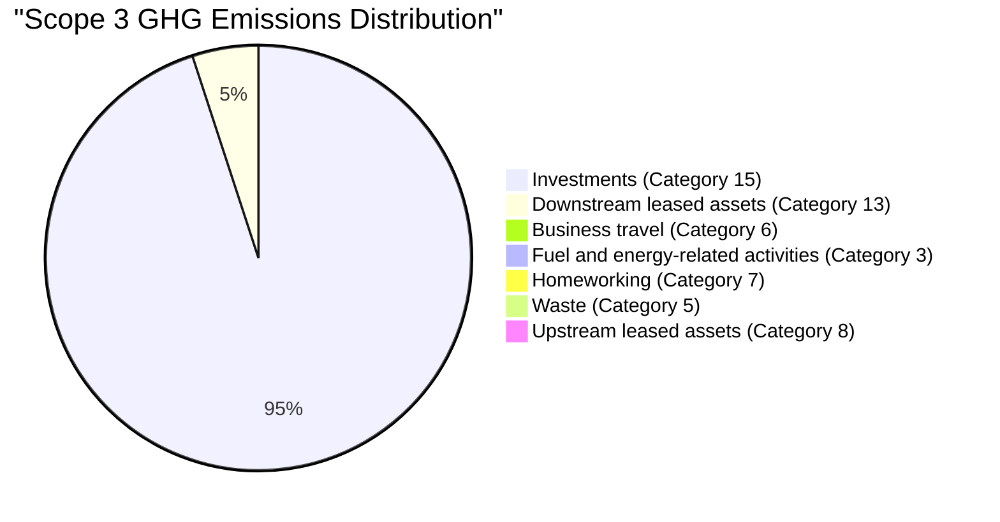
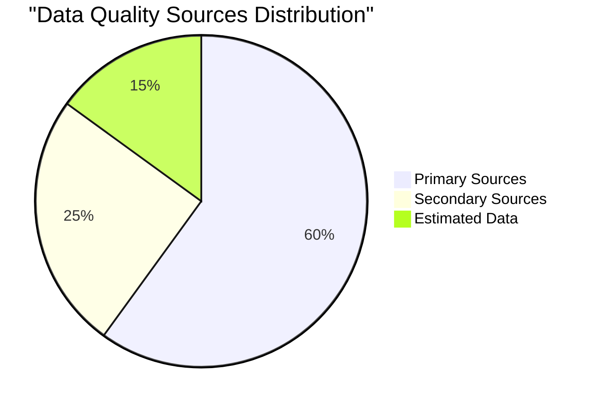

There should be two 'tabs' / subsection on the output. One is called Financed Emissions Analysis and the other one Data Quality Assessment.

1. FINANCED EMISSION ANALYSIS

Here we need to contrast the calculated Financed Emissions from the 18 dummy investments to the rest of their portfolio and external benchmarks. The key metrics to compare are the total emissions (in tCO2e), emission intensity i.e. expressed as tCO2e per £1m invested (tCO2e/£m), Weighted Average Carbon Intensity (WACI), and the implied portfolio temperature (in C).

There should be one summary dashboard and then breakdown per 18 investments.

On the summary dashboard for:

*   Total tCO2e: Per [https://group.legalandgeneral.com/media/1axftm2t/l-g-climate-and-nature-report-2024.pdf](https://group.legalandgeneral.com/media/1axftm2t/l-g-climate-and-nature-report-2024.pdf) their total Scope 3 carbon footprint is 4,900,000 tCO2e. Let's assume the 18 investments the total tCO2e is 180 tCO2e.

# Scope 3 GHG Emissions Distribution

This chart shows the breakdown of Scope 3 other indirect greenhouse gas emissions across key categories.

*   tCO2e/£m: Based on [https://group.legalandgeneral.com/media/idmbl4sh/legal-general-aoa-targets-2025.pdf](https://group.legalandgeneral.com/media/idmbl4sh/legal-general-aoa-targets-2025.pdf) the 2024 emission intensity for this subset of asset classes (covering 74% of £97.6bn of group proprietary, assets qualifying as Scope 3 - investment emissions) is 49tCO2e/£m, compared to an emission intensity of 51 tCO2e/£m on their full portfolio. So, let's assume the 18 investments have tCO2e/£m of 42 (i.e. on average they are greener than the rest of their investment).

*   WACI: Current portfolio WACI is 117

| investment portfolio weighted average  carbon intensity (WACI) | tCO2e/USD milion revenues |     |     | 169 | 151 | 117 |
|----------------------------------------------------------------|---------------------------|-----|-----|-----|-----|-----|
| investment portfolio GHG emissions                             | milion tC02e              | 6.7 | 6.2 | 5   | 5   | 4.9 |

*   Let's assume the WACI of 109 for the 18 dummy investments i.e. on average they are greener than the rest of their investment).

*   Implied portfolio temperature (C): Looking at their [https://group.legalandgeneral.com/media/1axftm2t/l-g-climate-and-nature-report-2024.pdf](https://group.legalandgeneral.com/media/1axftm2t/l-g-climate-and-nature-report-2024.pdf) the implied portfolio temperature is 2.8C. Let's again assume that the 18 investments have a lower implied temperature e.g. 2.5C.

```mermaid
%%{init: {"theme": "base", "themeVariables": {"primaryColor": "#FF0000", "secondaryColor": "#0000FF", "tertiaryColor": "#00AA00", "background": "#ffffff", "primaryBorderColor": "#FF0000", "secondaryBorderColor": "#0000FF"}}}%%
xychart-beta
    title "Portfolio Temperature Measures (°C)"
    x-axis ["2021 Scopes1&2", "2021 L&G", "2021 Scopes1,2&3", "2023 Scopes1&2", "2023 L&G", "2023 Scopes1,2&3", "2024 Scopes1&2", "2024 L&G", "2024 Scopes1,2&3"]
    y-axis "Temperature (°C)" 2.3 --> 3.0
    bar "Scopes 1&2" [2.6, 0, 0, 2.5, 0, 0, 2.5, 0, 0]
    bar "L&G Portfolio" [0, 2.4, 0, 0, 2.4, 0, 0, 2.5, 0]
    bar "Scopes 1,2&3" [0, 0, 2.9, 0, 0, 2.7, 0, 0, 2.8]
```

This chart compares L&G and Benchmark values for Bonds and Equity.

```mermaid
%%{init: {"theme": "base", "themeVariables": {"primaryColor": "#FF0000", "secondaryColor": "#0000FF", "tertiaryColor": "#0000FF", "background": "#ffffff", "primaryBorderColor": "#FF0000", "secondaryBorderColor": "#0000FF"}}}%%
xychart-beta
    title "2024 Implied Portfolio Temperature Alignment (°C)"
    x-axis ["Bonds L&G", "Bonds Benchmark", "Equity L&G", "Equity Benchmark"]
    y-axis "Temperature (°C)" 2.2 --> 2.7
    bar "L&G" [2.5, 0, 2.6, 0]
    bar "Benchmark" [0, 2.4, 0, 2.3]
```

| Matrics                                                                                                                                                                                                | Aggregation approach       | Scopes    | 2021 base year | 2024 | Target |
|--------------------------------------------------------------------------------------------------------------------------------------------------------------------------------------------------------|----------------------------|-----------|----------------|------|--------|
| We commmit to align the (SBTi-defined) portifolio temperature rating score for our listed equity. Corporate bonds and coropration loans portfolio, within our sharehold-owned investments, as follows: |                            |           |                |      |        |
| From 2.4 at end 2021 to 2.1 degree by end 2026, covering portfolio company scopres 1 and 2                                                                                                             | degree (ECOTS aggregation) | 1 and 2   | 2.4            | 2.5  | 2.1    |
| From 2.9 at end 2021 to 2.5 degree by end 2026, covering portfolio company scopres 1,2 and 3                                                                                                           | degree (ECOTS aggregation) | 1,2 and 3 | 2.9            | 2.8  | 2.5    |

For the breakdown we need to show how these 18 assets compare individually, against sector level and asset class level (at L&G and benchmark per above).

*   From [https://group.legalandgeneral.com/media/1axftm2t/l-g-climate-and-nature-report-2024.pdf](https://group.legalandgeneral.com/media/1axftm2t/l-g-climate-and-nature-report-2024.pdf) we see the following

| Score breakdown by asset class | By value | Standalone emissions intensity | GHG emissions (milion tCO2e) | PCAF data quality |
|--------------------------------|----------|--------------------------------|------------------------------|-------------------|
| Bond                           | 90       | 55                             | 4.7                          | 2.3               |
| Property                       | 9        | 14                             | 0.1                          | 2.3               |
| Equity                         | 1        | 33                             | 0                            | 2.3               |
| Total                          | 100      | 51                             | 4.9                          | 2.3               |

Table 4: Portfolio GHG emission intensities breakdown by asset class

| Score breakdown by asset class | By value | Standalone emissions intensity | GHG emissions (milion tCO2e) | PCAF data quality |
|--------------------------------|----------|--------------------------------|------------------------------|-------------------|
| Bond                           | 90       | 55                             | 4.7                          | 2.3               |
| Property                       | 9        | 14                             | 0.1                          | 2.3               |
| Equity                         | 1        | 33                             | 0                            | 2.3               |
| Total                          | 100      | 51                             | 4.9                          | 2.3               |

Table 5: Portfolio GHG emission intensities breakdown by sector

Let's mock up how these 18 assets compare against the above portfolio. For demonstration's sake, let's assume the numbers these 18 assets are lower across the board apart from the proposed in the Utilities sector e.g. 185 vs 158 on existing average. That can then drive a decision on whether to invest or avoid those proposed investments.

Then we should include the table with 18 assets and show the emissions. I think the tables you have a good. Please could the 'Investment Holdings' be renamed to 'Financed Emissions - Asset Level' and 'Emissions by Organisation' renamed to 'Financed Emissions - Asset Level'.

2. DATA QUALITY ASSESSMENT

Here we need to contrast the show the number of missing values found, estimated and imputed values, PCAF data quality score etc.

There should be one summary dashboard and then breakdown per 18 investments.

For the summary dashboard:

*   PCAF data quality score: Their overall portfolio score is 2.3 (the lower the better). Let's assume the estimated PCAF score for the portfolio is 2.6 (so worse as we had to estimate more because there are quite proportionately quite a direct investments – that is the narrative here)…

|                                                                                          | tCOe/£m |                     |        |
|------------------------------------------------------------------------------------------|---------|---------------------|--------|
| Measure                                                                                  | 2023    | 2024(constant EVIC) | 2024   |
| Investment portifoilo economic GHG emissions intensity                                   | 56      | 54                  | 51     |
| Reduction from 2023 - actual                                                             | NA      | 4%                  | 9%     |
| Reduction from 2019 - acutal                                                             | 30%     | 33%                 | 37%    |
| Reduction from 2019 - target                                                             | NA      | 18.50%              | 18.50% |
| PCAF Data Quality Score                                                                  | 2.5     | NA                  | 2.3    |
| Investment portiolio economic GHG emissions intensity ex-sovereigns                      | 52      | NA                  | 45     |
| Investment portiolio weighted average GHG emissions intensity (WACI) (tCO2/$m revenues)  | 127     | NA                  | 117    |

*   Sector and asset class comparions

Let's make up some dummy data and contrast 18 dummy investments against the portfolio. At asset class level the PCAF scores should be similair but showing a higher relative 'by value %' proportion of property and infrastructure equity in terms of the value %, and hence the worse PCAF score on average.

The intensity breakdown by sector should be lower given a higher relative value of investments into. of property and infrastructure equity.

The below are the numbers in the current portfolio.

| Score breakdown by asset class | By value | Standalone emissions intensity | GHG emissions (milion tCO2e) | PCAF data quality |
|--------------------------------|----------|--------------------------------|------------------------------|-------------------|
| Bond                           | 90       | 55                             | 4.7                          | 2.3               |
| Property                       | 9        | 14                             | 0.1                          | 2.3               |
| Equity                         | 1        | 33                             | 0                            | 2.3               |
| Total                          | 100      | 51                             | 4.9                          | 2.3               |

Table 4: Portfolio GHG emission intensities breakdown by asset class

| Score breakdown by asset class | By value | Standalone emissions intensity | GHG emissions (milion tCO2e) | PCAF data quality |
|--------------------------------|----------|--------------------------------|------------------------------|-------------------|
| Bond                           | 90       | 55                             | 4.7                          | 2.3               |
| Property                       | 9        | 14                             | 0.1                          | 2.3               |
| Equity                         | 1        | 33                             | 0                            | 2.3               |
| Total                          | 100      | 51                             | 4.9                          | 2.3               |

Table 5: Portfolio GHG emission intensities breakdown by sector

*   Primary vs secondary vs estimated data: There is no comparison against the portfolio. This is just a pie chart showing 60% data coming from primary sources, 25% from secondary sources and 15% estimated)

For the detailed dashboard:

*   There should be at least one table at the individual asset level. There probably aren't historical figures here - just the numbers above (e.g. PCAF score for that asset, % primary data, % secondary data, % estimated data) mocked up / made up at the asset level.

*   There should be at least one table summarising the DQ process at each stage (e.g. total number of failed mappings and rows mapped for correction at the end of Subprocess 1.3, total number of anomalies detected, how these were corrected e.g. a little bit as your Missing and Imputed Data Analysis table which is a good start, let's extend it a bit more / with a few more examples.
