# 🌿 Emissions Workflow Map

> Comprehensive visualization and analysis of the ESG emissions reporting workflow

Generated on: August 26, 2025  
Source: `emissions_workflow.json`

---

## 📋 Workflow Overview

The emissions workflow is a **12-step process** organized into **4 sequential stages** designed for comprehensive ESG emissions reporting and regulatory compliance, enhanced with **Amil's detailed data collection architecture**.

### **Key Metrics:**
- **Total Steps:** 12 (core) + 10 (Amil's enhancements) = 22 comprehensive steps
- **Sequential Stages:** 6 (Parse + Enhanced Data Collection + Original 4 stages)  
- **Parallel Processing:** 2 stages (Sub Process 1.2 + Emission Calculations)
- **Agent Types:** 6 distinct agent types (original 5 + Intent Parser)
- **Asset Classes:** 3 (Real Assets, Corporate Bonds, Infrastructure)

### **⚠️ Important Sequential Flow Correction:**
The enhanced workflow maintains **proper sequential dependencies**:
1. **Q0** (Parse ESG Query) → **Sub Process 1.1** (Portfolio Data Collection)
2. **Sub Process 1.1** → **Sub Process 1.2** (Carbon & Financial Data Collection)  
3. **Sub Process 1.2** → **Sub Process 1.3** (Final Data Merge)
4. **Sub Process 1.3** → **Enhanced Original Workflow** (Steps 1-12)

*Note: Sub Process 1.2 contains internal parallel processing (6 data sources), but the main stages remain sequential as in the original workflow.*

---

## 🗺️ Visual Workflow Map

```mermaid
graph TD
    %% Parse Layer (Amil's Addition)
    START[🎯 ESG Analysis Request] --> Q0[Parse ESG Query]
    
    %% Sub Process 1.1 - Portfolio Data Collection (Sequential after Q0)
    Q0 --> D1A[Collect Portfolio Data - Internal - Investments Under Consideration]
    Q0 --> D1B[Collect Portfolio Data - Internal - Guidance]
    D1A --> D1C[Merge Investments with Guidance]
    D1B --> D1C
    
    %% Sub Process 1.2 - Carbon & Financial Data (Sequential after 1.1, but internal parallel)
    D1C --> D2A[Internal - Climate Solution]
    D1C --> D2B[External Primary - Reported Emissions]
    D1C --> D2C[External Primary - Supply Chain]
    D1C --> D2D[External Secondary - Emission Factors]
    D1C --> D2E[External Secondary - Grid Energy]
    D1C --> D2F[External Secondary - Benchmarks]
    D2A --> D2G[Merge Carbon & Financial Data]
    D2B --> D2G
    D2C --> D2G
    D2D --> D2G
    D2E --> D2G
    D2F --> D2G
    
    %% Sub Process 1.3 - Final Merge
    D2G --> D3[Merge Portfolio Data]
    
    %% Enhanced Stage 1: Data Acquisition (Sequential - Enhanced)
    D3 --> S1[Step 1: Collect Internal Portfolio Data - Enhanced]
    S1 --> S2[Step 2: Obtain Carbon & Financial Data - Enhanced]
    S2 --> S3[Step 3: Integrate and Initial Merge - Enhanced]
    
    %% Stage 2: Data Validation
    S3 --> S4[Step 4: Data Completeness & Accuracy Audit]
    S4 --> S5[Step 5: Apply Proxy Data & Assumptions]
    S5 --> S6[Step 6: Generate Complete Dataset]
    
    %% Stage 3: Emission Calculations (Parallel)
    S6 --> S7[Step 7: Financed Emissions Calculation]
    S6 --> S8[Step 8: Sectoral Analysis & Breakdown]
    S6 --> S9[Step 9: Climate Risk Assessment]
    
    %% Stage 4: Reporting
    S7 --> S10[Step 10: Compile Evidence Pack]
    S8 --> S10
    S9 --> S10
    S10 --> S11[Step 11: Disclosure Preparation]
    S11 --> S12[Step 12: Integration into Annual Report]
    S12 --> COMPLETE[✅ Emissions Workflow Complete]
    
    %% Styling
    classDef intent fill:#2c5282,stroke:#2b6cb0,stroke-width:2px,color:#fff
    classDef dataAcq fill:#059669,stroke:#047857,stroke-width:2px,color:#fff
    classDef dataVal fill:#3b82f6,stroke:#2563eb,stroke-width:2px,color:#fff
    classDef emissionCalc fill:#7c3aed,stroke:#6d28d9,stroke-width:2px,color:#fff
    classDef assurance fill:#ea580c,stroke:#dc2626,stroke-width:2px,color:#fff
    classDef reporting fill:#dc2626,stroke:#b91c1c,stroke-width:2px,color:#fff
    classDef milestone fill:#1a202c,stroke:#2d3748,stroke-width:3px,color:#fff
    classDef cloud fill:#38b2ac,stroke:#319795,stroke-width:2px,color:#fff
    classDef onprem fill:#4a5568,stroke:#2d3748,stroke-width:2px,color:#fff
    classDef custom fill:#2b6cb0,stroke:#2c5282,stroke-width:2px,color:#fff
    
    class Q0 intent
    class D1A,D1B,D2A onprem
    class D2B,D2C,D2D,D2E,D2F cloud
    class D1C,D2G,D3 custom
    class S1,S2,S3 dataAcq
    class S4,S5,S6 dataVal
    class S7,S8,S9 emissionCalc
    class S10 assurance
    class S11,S12 reporting
    class START,COMPLETE milestone
```



---

## 🏗️ Detailed Stage Breakdown

### **🟢 Stage 1: Data Acquisition**
**Agent:** Data Acquisition Agent  
**Processing:** Sequential (1→2→3)  
**Duration:** Estimated 3-5 business days

| Step | Name | Purpose | Key Activities |
|------|------|---------|----------------|
| **1** | Collect Internal Portfolio Data | Gather internal portfolio information | • Extract holdings data<br>• Collect asset allocations<br>• Retrieve investment valuations |
| **2** | Obtain Carbon & Financial Data | Acquire carbon emissions and financial metrics | • Fetch Scope 1,2,3 emissions<br>• Collect financial performance data<br>• Gather benchmark data |
| **3** | Integrate and Initial Merge | Combine and align collected datasets | • Data harmonization<br>• Initial quality checks<br>• Create unified dataset |

**📤 Stage Output:** Integrated raw dataset ready for validation

---

### **🔵 Stage 2: Data Validation**
**Agent:** Data Validation Agent  
**Processing:** Sequential (4→5→6)  
**Duration:** Estimated 2-3 business days

| Step | Name | Purpose | Key Activities |
|------|------|---------|----------------|
| **4** | Data Completeness & Accuracy Audit | Ensure data completeness and accuracy | • Missing data identification<br>• Data quality scoring<br>• Outlier detection |
| **5** | Apply Proxy Data & Assumptions | Fill gaps with proxy data and assumptions | • Proxy methodology application<br>• Statistical estimation<br>• Assumption documentation |
| **6** | Data Verification & Sign-off | Final review and approval of validated data | • Senior review process<br>• Data lineage documentation<br>• Quality assurance sign-off |

**📤 Stage Output:** Validated, complete dataset with quality assurance

---

### **🟣 Stage 3: Emission Calculations**
**Agent:** Emission Calculation Agent  
**Processing:** ⚡ **Parallel** (7, 8, 9 simultaneously)  
**Duration:** Estimated 1-2 business days

| Step | Name | Asset Class | Calculation Focus |
|------|------|-------------|-------------------|
| **7** | Calculate Emissions for Real Assets Equity | Real Assets | • Direct property emissions<br>• Tenant emissions allocation<br>• Energy efficiency metrics |
| **8** | Calculate Emissions for Corporate Bonds | Corporate Bonds | • Issuer emissions attribution<br>• EVIC-based allocation<br>• Credit quality weighting |
| **9** | Calculate Emissions for Infrastructure Equity | Infrastructure | • Operational emissions<br>• Construction emissions<br>• Lifecycle assessment |

**📤 Stage Output:** Asset-class specific emissions calculations with detailed methodologies

---

### **🟠🔴 Stage 4: Reporting**
**Agents:** Assurance Agent + Reporting Agent  
**Processing:** Sequential (10→11→12)  
**Duration:** Estimated 3-4 business days

| Step | Name | Agent | Purpose | Key Deliverables |
|------|------|-------|---------|------------------|
| **10** | Compile Evidence Pack | Assurance | Gather supporting documentation | • Calculation worksheets<br>• Data source documentation<br>• Methodology explanations |
| **11** | Disclosure Preparation | Reporting | Prepare regulatory/stakeholder reports | • TCFD disclosures<br>• SFDR reporting<br>• Carbon footprint summaries |
| **12** | Integration into Annual Report | Reporting | Incorporate into formal annual reporting | • Annual report sections<br>• ESG performance metrics<br>• Regulatory compliance confirmation |

**📤 Stage Output:** Complete emissions reporting package ready for publication

---

## 🔄 Workflow Dependencies

### **Sequential Dependencies:**
```
Stage 1 → Stage 2 → Stage 3 → Stage 4
  ↓         ↓         ↓         ↓
Steps     Steps     Steps     Steps
1→2→3     4→5→6     7‖8‖9     10→11→12
```

### **Critical Path Analysis:**
- **Longest Path:** Steps 1→2→3→4→5→6→(7,8,9)→10→11→12
- **Parallel Efficiency:** Stage 3 reduces timeline by processing asset classes simultaneously
- **Bottlenecks:** Data validation (Stage 2) and final reporting (Stage 4)

---

## 👥 Agent Responsibilities

### **🟢 Data Acquisition Agent** (25% of workflow)
- **Steps:** 1, 2, 3
- **Expertise:** Data sourcing, API integrations, data harmonization
- **Tools:** Portfolio management systems, ESG data providers, internal databases

### **🔵 Data Validation Agent** (25% of workflow)
- **Steps:** 4, 5, 6
- **Expertise:** Data quality, statistical methods, proxy methodologies
- **Tools:** Data validation frameworks, statistical software, quality control systems

### **🟣 Emission Calculation Agent** (25% of workflow)
- **Steps:** 7, 8, 9
- **Expertise:** Carbon accounting, PCAF methodology, asset-specific calculations
- **Tools:** GHG calculation engines, PCAF standard, lifecycle assessment tools

### **🟠 Assurance Agent** (8.3% of workflow)
- **Steps:** 10
- **Expertise:** Audit processes, evidence compilation, documentation standards
- **Tools:** Document management systems, audit trail software

### **🔴 Reporting Agent** (16.7% of workflow)
- **Steps:** 11, 12
- **Expertise:** Regulatory reporting, stakeholder communication, disclosure frameworks
- **Tools:** Reporting platforms, TCFD frameworks, annual report systems

---

## 📊 Asset Class Coverage

### **Real Assets Equity (Step 7)**
**Focus Areas:**
- Commercial real estate properties
- Residential property portfolios
- Land and development assets
- Energy efficiency metrics

**Emission Sources:**
- Building operations (heating, cooling, lighting)
- Tenant energy consumption
- Property management activities
- Development and construction

### **Corporate Bonds (Step 8)**
**Focus Areas:**
- Investment-grade corporate bonds
- High-yield bond portfolios
- Government and municipal bonds
- Credit risk integration

**Emission Sources:**
- Issuer company operations
- Financed emissions allocation
- Industry-specific methodologies
- Credit quality considerations

### **Infrastructure Equity (Step 9)**
**Focus Areas:**
- Transportation infrastructure
- Energy generation and distribution
- Water and waste management
- Digital infrastructure

**Emission Sources:**
- Operational emissions
- Construction and development
- End-of-life considerations
- User/customer emissions

---

## ⚡ Parallel Processing Benefits

### **Stage 3 Optimization:**
The emission calculations stage leverages parallel processing to:

- **Reduce Timeline:** 3 days → 1-2 days (33-50% improvement)
- **Specialist Focus:** Each agent optimizes for specific asset class
- **Resource Efficiency:** Concurrent data processing and calculation
- **Quality Enhancement:** Dedicated expertise per asset type

### **Scalability Considerations:**
- **Additional Asset Classes:** Can add new parallel calculation streams
- **Computational Resources:** May require additional processing capacity
- **Data Dependencies:** Each calculation needs validated data from Stage 2

---

## 🎯 Regulatory Alignment

### **Key Standards Supported:**
- **PCAF Standard:** Partnership for Carbon Accounting Financials methodology
- **TCFD:** Task Force on Climate-related Financial Disclosures
- **SFDR:** EU Sustainable Finance Disclosure Regulation
- **GHG Protocol:** Greenhouse Gas Protocol Corporate Standard

### **Compliance Outputs:**
- **Scope 1, 2, 3 Emissions:** Complete carbon footprint assessment
- **Financed Emissions:** Portfolio-level emission attribution
- **Data Quality Scores:** Transparency on estimation vs. reported data
- **Evidence Documentation:** Full audit trail for regulatory review

---

## 🔧 Implementation Considerations

### **Technology Requirements:**
- **Data Integration Platform:** Capable of handling multiple data sources
- **Calculation Engine:** PCAF-compliant emission calculation algorithms
- **Workflow Management:** Orchestration of sequential and parallel processes
- **Documentation System:** Automated evidence pack generation

### **Governance Framework:**
- **Quality Gates:** Review checkpoints at each stage completion
- **Version Control:** Data lineage and calculation versioning
- **Approval Workflows:** Senior management sign-off processes
- **Audit Trail:** Complete documentation for regulatory inspection

### **Success Metrics:**
- **Data Completeness:** Target >95% coverage across portfolio
- **Calculation Accuracy:** Alignment with PCAF data quality standards
- **Timeline Adherence:** Complete workflow within 10-12 business days
- **Regulatory Compliance:** 100% alignment with disclosure requirements

---

## 🚀 Optimization Opportunities

### **Process Improvements:**
1. **Automation Enhancement:** Increase automated data validation rules
2. **Parallel Expansion:** Consider parallel processing in other stages
3. **Data Source Integration:** Real-time feeds for reduced manual intervention
4. **Template Standardization:** Reusable calculation templates per asset class

### **Technology Enhancements:**
1. **Machine Learning:** Automated proxy data generation and quality scoring
2. **API Integration:** Direct connections to major ESG data providers
3. **Real-time Monitoring:** Continuous data quality monitoring
4. **Cloud Scaling:** Dynamic resource allocation for parallel processing

---

## 🔄 Amil's Feedback Implementation Mapping

> **Cross-Reference:** This section maps Amil's detailed ESG DAG feedback to the emissions workflow stages

Based on the comprehensive feedback analysis in `amil-feedback-implementation-plan.md`, here's where each improvement should be implemented within the emissions workflow:

### **🎯 Stage 1: Data Acquisition - Enhanced Implementation**

**Current Workflow Coverage:**
- Step 1: Collect Internal Portfolio Data
- Step 2: Obtain Carbon & Financial Data  
- Step 3: Integrate and Initial Merge

**🔄 Amil's Sub Process Enhancements:**

#### **📊 Sub Process 1.1 - Portfolio Data Collection** (Enhances Steps 1-3)
**Implementation Location:** Between current Steps 1-2, expanding data acquisition scope

**New Detailed Steps:**
- **Step 1A:** Collect Portfolio Data - Internal - Investments Under Consideration
  - **Tool:** `data.extract_excel_data`
  - **Source:** Proposed Portfolio for ESG Scope 3 Analysis.xlsx
  - **Output:** 18 assets, $46m total investment value
  - **Asset Types:** Bonds, Real Estate, Infrastructure

- **Step 1B:** Collect Portfolio Data - Internal - Guidance  
  - **Tool:** `analysis.extract_esg_guidance`
  - **Sources:** ClimateSolution.PDF, MiddleOffice.SQLServer, ESGReporting.SQLServer
  - **Output:** 87 guidance rules extracted

- **Step 1C:** Collect Portfolio Data - Merge Investments with Guidance
  - **Tool:** `analysis.merge_multiple_sources`
  - **Purpose:** Harmonize investment data with internal guidance
  - **Output:** Standardized holdings dataset with mapped classifications

#### **🌿 Sub Process 1.2 - Carbon & Financial Data** (Enhances Step 2)
**Implementation Location:** Parallel expansion of Step 2 into 6 specialized data streams

**New Parallel Collection Agents:**
- **Step 2A:** Internal Climate Solution Data
- **Step 2B:** External Primary - Reported Emissions and Financials
- **Step 2C:** External Primary - Supply Chain Emissions  
- **Step 2D:** External Secondary - Emission Factors
- **Step 2E:** External Secondary - Grid Energy Intensity
- **Step 2F:** External Secondary - Industry and National Benchmarks
- **Step 2G:** Merge Internal and External Carbon/Financial Inputs

#### **🔄 Sub Process 1.3 - Final Data Merging** (Replaces Step 3)
**Implementation Location:** Enhanced version of current Step 3

**Unified Merge Process:**
- **Tool:** `analysis.merge_multiple_sources`
- **Inputs:** Sub Process 1.1 output + Sub Process 1.2 output
- **Enhanced Schema:** Includes real estate subschema, EVIC data, scope 1/2/3 emissions
- **Quality Metrics:** 75% primary emissions data coverage, 6 assets with missing values

### **🔵 Stage 2: Data Validation - Integration Points**

**Enhanced Validation Requirements:**

#### **Step 4: Data Completeness & Accuracy Audit**
- **Additional Validation:** PCAF data quality scoring for financed emissions
- **Schema Validation:** Verify new standardized asset schema from Sub Process 1.3
- **Coverage Assessment:** Validate 75% primary emissions data threshold

#### **Step 5: Apply Proxy Data & Assumptions**
- **Enhanced Proxies:** Use industry benchmarks from Sub Process 1.2F
- **Asset-Specific Proxies:** Apply different methodologies for bonds vs. real estate vs. infrastructure
- **Real Estate Enhancement:** Utilize new size/utilization/green rating data

#### **Step 6: Data Verification & Sign-off**
- **Expanded Review:** Include PCAF methodology compliance verification
- **Asset Class Validation:** Separate sign-off for each asset type methodology

### **🟣 Stage 3: Emission Calculations - Asset-Specific Enhancements**

**Current Parallel Processing Enhanced:**

#### **Step 7: Real Assets Equity** 
**🔄 Enhanced with Amil's Real Estate Schema:**
- **New Inputs:** SizeInSqm, Utilisation, GreenDesignRating
- **Enhanced Calculations:** Size-based emissions allocation, green design adjustments
- **Methodology:** Utilize merged portfolio data from Sub Process 1.3

#### **Step 8: Corporate Bonds**
**🔄 Enhanced with PCAF Category 15:**
- **New Scope:** PCAF Scope 3 Category 15 financed emissions focus
- **Enhanced Allocation:** EVIC-based attribution with ownership stake percentages
- **Data Sources:** Standardized issuer data from enhanced data collection

#### **Step 9: Infrastructure Equity**
**🔄 Enhanced Asset Classification:**
- **Expanded Coverage:** Infrastructure assets from Sub Process 1.1 classification
- **Enhanced Metrics:** Standardized sector/geography/location data
- **Improved Attribution:** Using enhanced financial parameters (EVIC, EBITDA)

### **🟠🔴 Stage 4: Reporting - Enhanced Compliance**

**Enhanced Reporting Capabilities:**

#### **Step 10: Compile Evidence Pack**
**🔄 Enhanced Documentation:**
- **Data Lineage:** Complete audit trail from 6 external data sources
- **Methodology Documentation:** PCAF Category 15 specific evidence
- **Quality Metrics:** Documentation of 75% primary data coverage vs. estimates

#### **Step 11: Disclosure Preparation**  
**🔄 Enhanced Regulatory Alignment:**
- **PCAF Compliance:** Specific Category 15 financed emissions disclosures
- **Asset Class Breakdown:** Separate reporting for bonds/real estate/infrastructure
- **Data Quality Transparency:** Clear flagging of estimated vs. reported data

#### **Step 12: Integration into Annual Report**
**🔄 Enhanced ESG Reporting:**
- **Comprehensive Portfolio View:** Unified 18-asset analysis
- **Investment Decision Support:** $46m portfolio optimization recommendations
- **Stakeholder Communication:** Enhanced transparency on data sources and methodologies

### **📈 Implementation Timeline Mapping**

| Amil's Enhancement | Current Workflow Stage | Implementation Impact |
|-------------------|------------------------|----------------------|
| **Sub Process 1.1** | Stage 1 (Steps 1-3) | ⏱️ +2-3 days (detailed portfolio analysis) |
| **Sub Process 1.2** | Stage 1 (Step 2) | ⚡ Parallel processing maintains timeline |
| **Sub Process 1.3** | Stage 1 (Step 3) | ⏱️ +1 day (enhanced merge complexity) |
| **Enhanced Validation** | Stage 2 (Steps 4-6) | ⏱️ +1 day (PCAF validation) |
| **Asset-Specific Calcs** | Stage 3 (Steps 7-9) | ➡️ No timeline change (parallel) |
| **Enhanced Reporting** | Stage 4 (Steps 10-12) | ⏱️ +1-2 days (comprehensive documentation) |

### **🎯 Success Integration Metrics**

**Enhanced KPIs from Amil's Feedback:**
- **Data Coverage:** Target >75% primary emissions data (vs. estimates)
- **Asset Granularity:** 18 individual asset analysis vs. portfolio-level
- **Methodology Compliance:** 100% PCAF Category 15 alignment
- **Financial Integration:** EVIC-based allocation accuracy >95%
- **Real Estate Enhancement:** Size/utilization/green rating coverage >90%

### **🔧 Technical Implementation Notes**

**System Enhancements Required:**
1. **Enhanced DAG Visualization:** Curved edges instead of rectangular (visual improvement)
2. **Expanded Node Architecture:** 10+ new nodes for detailed sub-processes
3. **Schema Evolution:** Enhanced input/output schemas with real estate subschema
4. **Parallel Processing Optimization:** 6 concurrent data streams in Sub Process 1.2
5. **Quality Metrics Dashboard:** Real-time monitoring of data coverage percentages

**Integration Strategy:**
- **Phase 1:** Implement visual improvements and Parse ESG Query enhancements
- **Phase 2:** Add Sub Process 1.1 detailed portfolio data collection
- **Phase 3:** Expand Sub Process 1.2 with 6 parallel data streams
- **Phase 4:** Integrate Sub Process 1.3 unified merge capabilities
- **Phase 5:** Enhance validation and reporting stages with new data richness

This enhanced emissions workflow incorporates Amil's comprehensive feedback while maintaining the core 4-stage structure, ensuring seamless integration of advanced ESG data collection, PCAF methodology compliance, and asset-specific emission calculations.

---

This emissions workflow map provides a comprehensive guide for implementing robust, scalable ESG emissions reporting that meets regulatory requirements while optimizing for efficiency and accuracy.
