# 🌿 Merged ESG Emissions Workflow Map

> Comprehensive integration of the current emissions workflow with Amil's detailed ESG DAG enhancements

Generated on: August 26, 2025  
Integration of: `emissions-workflow-map.md` + `amil-feedback-implementation-plan.md`

---

## 📋 Integrated Workflow Overview

The merged workflow combines the **12-step emissions reporting process** with **Amil's detailed data collection architecture**, creating a comprehensive **22-step ESG emissions analysis workflow** organized into **6 main stages**.

### **Key Metrics:**
- **Total Steps:** 22 (12 original + 10 new detailed steps)
- **Main Stages:** 6 (Parse + Enhanced Data Collection + Original 4 stages)
- **Parallel Processing:** 2 stages (Sub Process 1.2 + Emission Calculations)
- **Agent Types:** 6 distinct agent types (original 5 + Intent Parser)
- **Asset Classes:** 3 (Real Assets, Corporate Bonds, Infrastructure)
- **Data Sources:** 8+ external sources + internal systems

---

## 🗺️ Visual Merged Workflow Map

```mermaid
graph TD
    %% Parse Layer (Amil's Addition)
    START[🎯 ESG Analysis Request] --> Q0[Parse ESG Query]
    
    %% Sub Process 1.1 - Portfolio Data Collection (Amil's Enhancement)
    Q0 --> D1A[Collect Portfolio Data - Internal - Investments Under Consideration]
    Q0 --> D1B[Collect Portfolio Data - Internal - Guidance]
    D1A --> D1C[Merge Investments with Guidance]
    D1B --> D1C
    
    %% Sub Process 1.2 - Carbon & Financial Data (Amil's Enhancement - Parallel)
    Q0 --> D2A[Internal - Climate Solution]
    Q0 --> D2B[External Primary - Reported Emissions]
    Q0 --> D2C[External Primary - Supply Chain]
    Q0 --> D2D[External Secondary - Emission Factors]
    Q0 --> D2E[External Secondary - Grid Energy]
    Q0 --> D2F[External Secondary - Benchmarks]
    D2A --> D2G[Merge Carbon & Financial Data]
    D2B --> D2G
    D2C --> D2G
    D2D --> D2G
    D2E --> D2G
    D2F --> D2G
    
    %% Sub Process 1.3 - Final Merge (Amil's Enhancement)
    D1C --> D3[Merge Portfolio Data]
    D2G --> D3
    
    %% Enhanced Stage 1: Data Acquisition (Original + Amil's Integration)
    D3 --> S1[Collect Internal Portfolio Data - Enhanced]
    S1 --> S2[Extract External ESG Data - Enhanced]
    S2 --> S3[Integrate Multi-source Data - Enhanced]
    
    %% Stage 2: Data Validation (Enhanced with Amil's Schema)
    S3 --> S4[Data Completeness & Accuracy Audit]
    S4 --> S5[Apply Proxy Data & Assumptions]
    S5 --> S6[Generate Complete Dataset]
    
    %% Stage 3: Emission Calculations (Enhanced Parallel - Original)
    S6 --> S7[Financed Emissions Calculation]
    S6 --> S8[Sectoral Analysis & Breakdown]
    S6 --> S9[Climate Risk Assessment]
    
    %% Stage 4: Reporting (Enhanced with Amil's Evidence)
    S7 --> S10[Compile Evidence Pack]
    S8 --> S10
    S9 --> S10
    S10 --> S11[Disclosure Preparation]
    S11 --> S12[Integration into Annual Report]
    S12 --> COMPLETE[✅ Emissions Workflow Complete]
    
    %% Styling
    classDef intent fill:#2c5282,stroke:#2b6cb0,stroke-width:2px,color:#fff
    classDef dataAcq fill:#059669,stroke:#047857,stroke-width:2px,color:#fff
    classDef dataVal fill:#3b82f6,stroke:#2563eb,stroke-width:2px,color:#fff
    classDef emissionCalc fill:#7c3aed,stroke:#6d28d9,stroke-width:2px,color:#fff
    classDef assurance fill:#ea580c,stroke:#dc2626,stroke-width:2px,color:#fff
    classDef reporting fill:#dc2626,stroke:#b91c1c,stroke-width:2px,color:#fff
    classDef milestone fill:#1a202c,stroke:#2d3748,stroke-width:3px,color:#fff
    classDef cloud fill:#38b2ac,stroke:#319795,stroke-width:2px,color:#fff
    classDef onprem fill:#4a5568,stroke:#2d3748,stroke-width:2px,color:#fff
    classDef custom fill:#2b6cb0,stroke:#2c5282,stroke-width:2px,color:#fff
    
    class Q0 intent
    class D1A,D1B,D2A onprem
    class D2B,D2C,D2D,D2E,D2F cloud
    class D1C,D2G,D3 custom
    class S1,S2,S3 dataAcq
    class S4,S5,S6 dataVal
    class S7,S8,S9 emissionCalc
    class S10 assurance
    class S11,S12 reporting
    class START,COMPLETE milestone
```



---

## 🏗️ Detailed Merged Stage Breakdown

### **🎯 Stage 0: Intent Parsing (Amil's Addition)**
**Agent:** Intent Parser Agent  
**Processing:** Initial query interpretation  
**Duration:** < 1 hour

| Node | Name | Purpose | Key Activities |
|------|------|---------|----------------|
| **Q0** | Parse ESG Query | Interpret user ESG analysis request | • Parse natural language query<br>• Extract portfolio scope (Scope 3)<br>• Identify PCAF categories (Category 15)<br>• Determine asset types |

**📊 Enhanced Outputs:**
- `portfolio_scope`: 3 (Scope 3 emissions)
- `esg_metrics_requested`: "tCO2e"  
- `pcaf_scope_3_categories`: 15 (Financed emissions)
- `asset_types`: "bond | real estate | infrastructure"

---

### **🟢 Stage 1A: Sub Process 1.1 - Portfolio Data Collection (Amil's Enhancement)**
**Agent:** Data Acquisition Agent (Internal)  
**Processing:** Sequential with parallel initiation  
**Duration:** 1-2 business days

| Node | Name | Source | Key Activities |
|------|------|---------|----------------|
| **D1A** | Collect Portfolio Data - Internal - Investments Under Consideration | Proposed Portfolio for ESG Scope 3 Analysis.xlsx | • Extract 18 assets ($46m total)<br>• Identify asset types & sectors<br>• Map ownership stakes |
| **D1B** | Collect Portfolio Data - Internal - Guidance | ClimateSolution.PDF + Internal DBs | • Extract 87 guidance rules<br>• Map categorization logic<br>• Retrieve historical analysis |
| **D1C** | Merge Investments with Guidance | Combined Internal Sources | • Harmonize investment data<br>• Apply standardization rules<br>• Create master holdings dataset |

**📤 Stage Output:** Standardized portfolio dataset with 18 mapped investments

---

### **🌿 Stage 1B: Sub Process 1.2 - Carbon & Financial Data (Amil's Enhancement)**
**Agent:** Data Acquisition Agent (Multi-source)  
**Processing:** ⚡ **6-way Parallel Collection** → Merge  
**Duration:** 2-3 business days

| Node | Name | Type | Source | Focus |
|------|------|------|---------|-------|
| **D2A** | Internal - Climate Solution | Internal | ClimateSolution Internal DB | Internal carbon metrics |
| **D2B** | External Primary - Reported Emissions | External | Company disclosures, CDP | Direct reported emissions |
| **D2C** | External Primary - Supply Chain | External | Supplier networks | Scope 3 supply chain data |
| **D2D** | External Secondary - Emission Factors | External | DEFRA, EPA, IPCC | Standardized calculation factors |
| **D2E** | External Secondary - Grid Energy | External | National grid operators, IEA | Geographic energy intensity |
| **D2F** | External Secondary - Benchmarks | External | Sectoral benchmarks, national inventories | Industry comparison data |
| **D2G** | Merge Carbon & Financial Data | Merge | All above sources | Unified carbon/financial dataset |

**📤 Stage Output:** Comprehensive emissions dataset with 75% primary data coverage

---

### **🔄 Stage 1C: Sub Process 1.3 - Final Data Merging (Amil's Enhancement)**
**Agent:** Data Validation Agent  
**Processing:** Unified merge operation  
**Duration:** 1 business day

| Node | Name | Purpose | Enhanced Schema |
|------|------|---------|-----------------|
| **D3** | Merge Portfolio Data | Create unified investment view | • StandardisedAssetID<br>• InvestmentValue + OwnershipStake<br>• EVIC + Scope1/2/3 emissions<br>• Real estate subschema |

**📤 Stage Output:** Complete dataset ready for enhanced emissions workflow

---

### **🟢 Stage 2: Enhanced Data Acquisition (Original + Amil's Integration)**
**Agent:** Data Acquisition Agent  
**Processing:** Sequential (enhanced with merged data)  
**Duration:** 2-3 business days

| Step | Name | Enhancement | Key Activities |
|------|------|-------------|----------------|
| **S1** | Collect Internal Portfolio Data - Enhanced | Integrates D3 output | • Validate merged portfolio data<br>• Enhance with additional internal metrics<br>• Cross-reference with live portfolio |
| **S2** | Extract External ESG Data - Enhanced | Leverages D2G sources | • Supplement with real-time ESG data<br>• Validate against collected emissions data<br>• Add performance benchmarks |
| **S3** | Integrate Multi-source Data - Enhanced | Comprehensive integration | • Final data harmonization<br>• Quality scoring enhancement<br>• Prepare for validation stage |

**📤 Stage Output:** Enriched dataset combining Amil's detailed collection with current workflow

---

### **🔵 Stage 3: Enhanced Data Validation (Original + Schema Enhancement)**
**Agent:** Data Validation Agent  
**Processing:** Sequential with enhanced validation rules  
**Duration:** 2-3 business days

| Step | Name | Enhancement | Key Activities |
|------|------|-------------|----------------|
| **S4** | Data Completeness & Accuracy Audit | PCAF Category 15 focus | • Validate 75% primary data threshold<br>• PCAF data quality scoring<br>• Asset-specific validation rules |
| **S5** | Apply Proxy Data & Assumptions | Enhanced proxy methodologies | • Industry benchmark proxies (D2F)<br>• Asset-specific estimation methods<br>• Real estate size/utilization proxies |
| **S6** | Generate Complete Dataset | Enhanced schema output | • Include real estate subschema<br>• PCAF-compliant data grades<br>• Asset class-specific formatting |

**📤 Stage Output:** PCAF-compliant validated dataset with enhanced asset detail

---

### **🟣 Stage 4: Enhanced Emission Calculations (Original + Asset Enhancement)**
**Agent:** Emission Calculation Agent  
**Processing:** ⚡ **Parallel** with enhanced methodologies  
**Duration:** 1-2 business days

| Step | Name | Enhancement | Calculation Focus |
|------|------|-------------|-------------------|
| **S7** | Financed Emissions Calculation | PCAF Category 15 compliance | • EVIC-based attribution<br>• Ownership stake allocation<br>• Enhanced financial integration |
| **S8** | Sectoral Analysis & Breakdown | 18-asset granularity | • Asset-specific sector analysis<br>• Geographic breakdown enhancement<br>• Investment value weighting |
| **S9** | Climate Risk Assessment | Portfolio-specific scenarios | • $46m portfolio stress testing<br>• Asset class risk differentiation<br>• Enhanced scenario modeling |

**📤 Stage Output:** Asset-specific emissions with detailed attribution and risk analysis

---

### **🟠🔴 Stage 5: Enhanced Reporting (Original + Evidence Enhancement)**
**Agents:** Assurance Agent + Reporting Agent  
**Processing:** Sequential with comprehensive documentation  
**Duration:** 3-4 business days

| Step | Name | Enhancement | Key Deliverables |
|------|------|-------------|------------------|
| **S10** | Compile Evidence Pack | Comprehensive audit trail | • Data lineage from 8+ sources<br>• PCAF methodology documentation<br>• 18-asset calculation worksheets |
| **S11** | Disclosure Preparation | Enhanced regulatory alignment | • PCAF Category 15 disclosures<br>• Asset class breakdown reporting<br>• Data quality transparency |
| **S12** | Integration into Annual Report | Investment decision focus | • $46m portfolio performance<br>• Asset-specific ESG metrics<br>• Enhanced stakeholder communication |

**📤 Stage Output:** Comprehensive ESG reporting package with investment decision support

---

## 🔄 Integrated Workflow Dependencies

### **Enhanced Sequential Flow:**
```
Stage 0 → Stage 1A + 1B → Stage 1C → Stage 2 → Stage 3 → Stage 4 → Stage 5
   Q0   →   D1A,D1B     →    D3    →  S1→S3  →  S4→S6  → S7‖S8‖S9 → S10→S12
         →   D2A-D2F    →          
```

### **Parallel Processing Optimization:**
- **Stage 1B:** 6 concurrent data collection streams (D2A-D2F)
- **Stage 4:** 3 concurrent emission calculations (S7, S8, S9)
- **Total Parallel Efficiency:** Reduces 9 sequential steps to 2 parallel stages

---

## 👥 Enhanced Agent Responsibilities

### **🎯 Intent Parser Agent** (4.5% of workflow)
- **Node:** Q0
- **Expertise:** Natural language processing, ESG query interpretation
- **Tools:** NLP engines, portfolio analysis frameworks

### **🟢 Data Acquisition Agent** (40.9% of workflow)
- **Nodes:** D1A, D1B, D2A-D2F, S1-S3
- **Expertise:** Multi-source data integration, API management, data harmonization
- **Tools:** Excel processors, web scrapers, database connectors, cloud APIs

### **🔵 Data Validation Agent** (18.2% of workflow)
- **Nodes:** D1C, D2G, D3, S4-S6
- **Expertise:** PCAF compliance, statistical validation, schema enhancement
- **Tools:** PCAF validators, statistical software, data quality frameworks

### **🟣 Emission Calculation Agent** (13.6% of workflow)
- **Nodes:** S7-S9
- **Expertise:** PCAF Category 15 methodology, asset-specific calculations
- **Tools:** Enhanced GHG calculation engines, financial attribution models

### **🟠 Assurance Agent** (4.5% of workflow)
- **Nodes:** S10
- **Expertise:** Comprehensive audit trails, multi-source evidence compilation
- **Tools:** Enhanced document management, audit trail software

### **🔴 Reporting Agent** (18.2% of workflow)
- **Nodes:** S11-S12
- **Expertise:** PCAF-compliant reporting, investment decision communication
- **Tools:** Enhanced reporting platforms, PCAF disclosure frameworks

---

## 📊 Enhanced Asset Class Coverage

### **Real Assets Equity (Enhanced)**
**Data Sources:** D1A portfolio data + D2A-D2F emissions data  
**Schema Enhancements:**
- `SizeInSqm`: Property size metrics
- `Utilisation`: Occupancy and usage rates
- `GreenDesignRating`: Sustainability certifications

**Enhanced Calculations:**
- Size-based emission allocation
- Green design carbon adjustments
- Utilization-weighted attribution

### **Corporate Bonds (Enhanced)**
**PCAF Category 15 Focus:**
- Enhanced EVIC-based allocation methodology
- Ownership stake percentage precision
- Credit quality carbon risk integration

**Data Integration:**
- Standardized issuer data from D1C
- External financial metrics from D2B
- Industry benchmarks from D2F

### **Infrastructure Equity (Enhanced)**
**Expanded Coverage:**
- Enhanced asset classification from D1C
- Geographic energy intensity from D2E
- Lifecycle assessment integration

**Improved Attribution:**
- Enhanced EVIC/EBITDA financial parameters
- Standardized sector/geography mapping
- Construction vs. operational emission separation

---

## ⚡ Enhanced Parallel Processing Benefits

### **Stage 1B Optimization (6-way Parallel):**
- **Reduces Timeline:** 6-8 days → 2-3 days (60% improvement)
- **Source Diversification:** 8+ external data sources simultaneously
- **Quality Enhancement:** Primary vs. secondary data prioritization
- **Scalability:** Easy addition of new data sources

### **Stage 4 Optimization (Asset-Class Parallel):**
- **Maintains Efficiency:** 3 days → 1-2 days (original benefit)
- **Enhanced Granularity:** 18 individual asset calculations
- **Methodology Specialization:** Asset-specific PCAF applications

### **Combined Parallel Benefit:**
- **Total Timeline Reduction:** 15-18 days → 10-12 days (33% improvement)
- **Quality Enhancement:** 75% primary data vs. estimates
- **Granularity Improvement:** Portfolio-level → 18 individual assets

---

## 🎯 Enhanced Regulatory Alignment

### **PCAF Category 15 Compliance:**
- **Financed Emissions Focus:** Specific Category 15 methodology implementation
- **Data Quality Transparency:** Clear primary vs. estimated data flagging
- **Attribution Accuracy:** EVIC-based allocation with ownership stakes

### **Enhanced Standards Support:**
- **TCFD:** Enhanced climate risk assessment with portfolio scenarios
- **SFDR:** Asset-specific ESG performance metrics
- **GHG Protocol:** Comprehensive Scope 1/2/3 coverage with enhanced data

### **Investment Decision Integration:**
- **Portfolio Optimization:** $46m portfolio-specific recommendations
- **Asset Performance:** Individual asset ESG scoring and ranking
- **Risk Assessment:** Asset class-specific climate risk profiling

---

## 🔧 Implementation Considerations

### **Enhanced Technology Requirements:**
- **Multi-source Integration:** 8+ external API connections
- **Enhanced Calculation Engine:** PCAF Category 15 compliant algorithms
- **Real Estate Schema Support:** Size/utilization/green rating processing
- **Evidence Compilation:** Multi-source audit trail automation

### **Enhanced Governance Framework:**
- **Quality Gates:** PCAF data quality score validation at each stage
- **Version Control:** Enhanced data lineage across 22 workflow steps
- **Approval Workflows:** Asset-specific review processes
- **Audit Trail:** Complete 8-source to final report documentation

### **Enhanced Success Metrics:**
- **Data Coverage:** >75% primary emissions data (vs. estimates)
- **Asset Granularity:** 18 individual asset analysis completion
- **PCAF Compliance:** 100% Category 15 methodology alignment
- **Timeline Efficiency:** Complete enhanced workflow within 10-12 business days

---

## 🚀 Implementation Strategy

### **Phase 1: Foundation (Weeks 1-2)**
- Implement intent parsing (Q0) with enhanced query interpretation
- Add curved edge visualization improvements
- Establish enhanced color coding and positioning

### **Phase 2: Data Collection Enhancement (Weeks 3-4)**
- Implement Sub Process 1.1 (D1A, D1B, D1C)
- Add internal portfolio and guidance data collection
- Establish standardized asset schema

### **Phase 3: Multi-source Data Integration (Weeks 5-6)**
- Implement Sub Process 1.2 (D2A-D2G) with 6-way parallel processing
- Integrate external data sources and APIs
- Establish emissions data collection pipelines

### **Phase 4: Workflow Integration (Weeks 7-8)**
- Implement Sub Process 1.3 (D3) unified merge
- Enhance existing stages (S1-S12) with new data richness
- Integrate PCAF Category 15 methodology

### **Phase 5: Validation & Optimization (Weeks 9-10)**
- End-to-end testing with 18-asset portfolio
- Performance optimization for parallel processing
- Final regulatory compliance validation

---

## 📈 Business Value Enhancement

### **Investment Decision Support:**
- **Portfolio-Specific Analysis:** $46m investment portfolio optimization
- **Asset-Level Insights:** Individual ESG performance ranking and scoring
- **Risk-Adjusted Returns:** Climate risk integration with financial performance

### **Regulatory Advantage:**
- **PCAF Leadership:** Category 15 financed emissions compliance
- **Data Transparency:** 75% primary data coverage exceeds industry standards
- **Audit Readiness:** Comprehensive multi-source evidence documentation

### **Operational Efficiency:**
- **Timeline Optimization:** 33% faster completion with enhanced data quality
- **Automation Enhancement:** Reduced manual intervention through API integration
- **Scalability:** Framework supports portfolio expansion and additional asset classes

---

This merged ESG emissions workflow map creates a comprehensive, regulatory-compliant, and investment-decision-focused ESG analysis framework that combines the best of both the current emissions workflow and Amil's detailed enhancement requirements.
